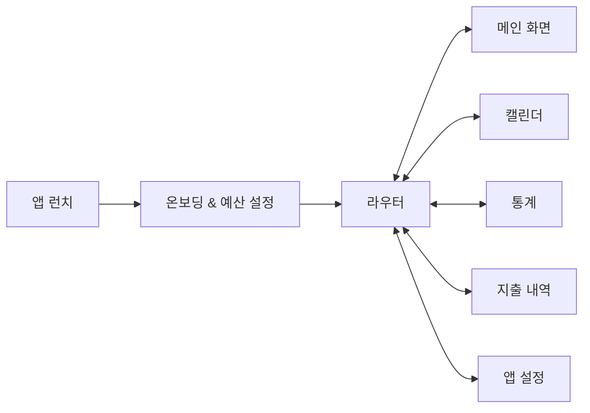
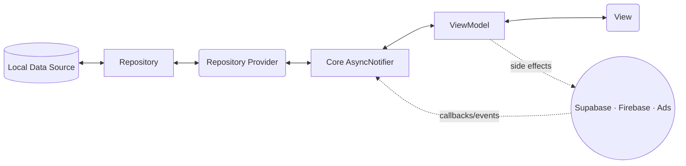

<!-- @format -->

<h1 align="center">MoneyFit</h1>

<p align="center">
  자율 지출과 필수 지출을 분리해 남은 예산을 더 직관적으로 관리하는 개인 재무 앱
</p>

<p align="center">
  Flutter · Riverpod · SQLite · Supabase · Firebase
</p>

<p align="center">
  
</p>

## 한눈에 보기

- **예산 중심 관리**: 일일·월간 예산과 월간 자율 지출 목표를 설정하고, 남은 예산을 빠르게 확인할 수 있습니다.
- **지출 분리 기록**: 자유롭게 쓸 수 있는 **자율 지출**과 반드시 써야 하는 **필수 지출**을 구분해 기록합니다.
- **패턴 분석**: 캘린더, 통계, 지출 내역 화면을 통해 소비 흐름을 입체적으로 확인할 수 있습니다.
- **지속 사용 설계**: 알림, 리뷰 유도, 다국어·통화 변경, 테마/텍스트 크기 조절 기능으로 사용성을 높였습니다.

## 주요 기능

- **온보딩**
  초기 화폐 단위, 일일·월간 예산, 월간 자율 지출 목표를 설정해 앱 사용 전 필요한 데이터를 로컬에 준비합니다.

- **홈 대시보드**
  일일/월간 지출 현황을 원형 게이지로 시각화하고, 월평균 변동 지출, 연속 목표 달성일, 오늘의 지출 요약, 빠른 지출 등록 바텀 시트를 제공합니다.

- **캘린더**
  날짜별 성공/실패 배지와 필수/자율 지출 합계를 표시하고, 월간 통계 패널과 일별 상세 내역을 바텀 시트로 보여줍니다.

- **통계**
  월간 카테고리별 파이차트, TOP3 지출, 월 전환 시 즉시 재계산되는 지표를 제공해 소비 패턴을 다각도로 분석합니다.

- **지출 내역**
  월간 전체 지출을 스크롤로 조회하고, 유형/카테고리/정렬 필터와 바텀 시트 입력 폼을 통해 CRUD를 처리합니다.

## 사용자 흐름

아래 플로우차트는 핵심 화면 이동 구조를 간단히 요약합니다.



## 기술 스택

- **클라이언트**
  Flutter 3.8, Riverpod, GoRouter, Intl, Flutter Local Notifications, fl_chart, Flutter Phoenix

- **데이터 저장/백엔드**
  SQLite, Supabase, Firebase (Core, Analytics, Remote Config)

- **운영/성장 도구**
  Google Mobile Ads, NotificationService, ReviewPromptService, Firebase Analytics Observer

- **아키텍처**
  Feature-first MVVM + 계층형 저장소 구조를 사용합니다.

  ```text
  Database -> Repository -> RepositoryProvider -> Core AsyncNotifier -> Feature ViewModel -> View
  ```

  데이터는 위 순서대로 전달되며, 외부 서비스는 ViewModel에서 사이드 이펙트로 주입됩니다.



## 프로젝트 구조

Feature-first 형식의 MVVM 패턴을 적용했습니다.

```text
lib/
 ├── core/          # 공통 인프라 (DB, 서비스, 라우터, 테마, Provider)
 │   ├── database
 │   ├── repositories
 │   └── provider
 ├── features/      # 도메인 모듈 (home, calendar, expense, statistics, settings ...)
 │   ├── view/
 │   ├── viewmodel/
 │   └── model/
 └── widgets/       # 전역 위젯 (탭바, 다이얼로그 등)
```

- **`core/`**
  DatabaseHelper, Repository 추상화, AppInitializer, 광고/알림/리뷰 서비스 등 크로스커팅 로직을 담당합니다.

- **`features/`**
  각 도메인이 `View`, `ViewModel`, `Model` 3단계로 구성되며, 화면과 비즈니스 로직을 분리해 테스트와 리팩터링을 쉽게 합니다.

- **`widgets/`**
  탭바, 공통 바텀 시트, 다이얼로그 등 재사용 가능한 프레젠테이션 컴포넌트를 모아 유지보수를 단순화합니다.

## 업데이트

최신 변경 사항은 [CHANGELOG.md](./CHANGELOG.md)에서 확인할 수 있습니다.

- **현재 버전**: `1.2.6`
- **최근 업데이트**: 메인 테마 변경, 텍스트 크기 조절, 다국어 확장, 언어 및 통화 변경 기능 추가
