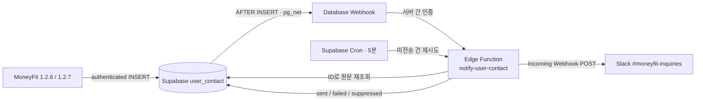

# 1.2.7 사용자 문의 Slack 알림 구현 계획

## 1. 목표와 완료 기준

설정 화면의 **문의하기**에서 접수된 문의는 Supabase에 먼저 안전하게 보존하고, 운영자 전용 Slack 채널로 자동 전달한다. Slack 장애가 문의 저장 실패로 보이면 안 되며, 이미 배포된 1.2.6 앱에서 들어오는 문의도 알림 대상이어야 한다.

완료 기준은 다음과 같다.

- 문의 저장 후 정상 상황에서 60초 안에 운영 Slack 채널에 한 건의 알림이 도착한다.
- Slack Incoming Webhook URL과 Supabase 관리자 키는 Flutter 코드, `.env`, 앱 번들, Git 이력 어디에도 포함되지 않는다.
- Slack 장애 시 문의 원문은 `user_contact`에 남고, 실패 상태가 기록되어 자동 재시도된다.
- 같은 DB 이벤트가 중복 전달돼도 일반적인 경우 Slack 메시지는 한 번만 발송된다.
- 문의 내용에 `@channel`, 링크 문법 등의 문자열이 있어도 멘션이나 의도하지 않은 서식으로 해석되지 않는다.
- 1.2.6 앱의 기존 직접 INSERT와 1.2.7 앱의 개선된 INSERT 모두 알림이 발생한다.
- 익명 인증 사용자는 자기 `uid`로만 문의를 추가할 수 있고, 다른 문의를 읽거나 수정할 수 없다.
- 지원하는 14개 언어에서 문의 유형 표시와 성공/실패 UX가 깨지지 않는다.

## 2. 저장소 조사 결과

### 현재 문의 흐름

- 진입점: `lib/features/settings/widgets/app_information_section.dart`
  - 설정의 앱 정보 카드에서 `ContactUsDialog`를 연다.
- 입력/저장: `lib/features/settings/widgets/contact_us_dialog.dart`
  - 문의 유형 4개, 선택 입력인 회신 이메일, 최대 500자의 문의 내용을 받는다.
  - `Supabase.instance.client.from('user_contact').insert(...)`로 Flutter 클라이언트가 DB에 직접 INSERT한다.
  - 저장 값은 `uid`(세션이 있을 때만), `inquiry_type`, `email`, `details`, `platform`이다.
  - 현재 `inquiry_type`에는 `bug_report` 같은 고정 코드가 아니라 사용 언어로 번역된 화면 문구가 저장된다. 운영 집계와 Slack 분류에 불리하다.
  - 전송 중 버튼 잠금이 없어 연속 탭으로 중복 INSERT가 가능하다.
  - 실패해도 다이얼로그가 닫혀 사용자가 작성한 내용을 잃는다.
- 인증: `lib/features/settings/viewmodel/user_settings_provider.dart`
  - Supabase 세션이 없으면 `signInAnonymously()`를 수행한다.
  - 다만 문의 코드는 현재 사용자를 필수로 기다리지 않고 `uid`를 생략할 수 있다.
- 유사 데이터: `lib/core/services/review_prompt_service.dart`
  - 부정적 리뷰 피드백은 `app_feedback`에 직접 저장하지만, 현재 Slack 알림 대상은 우선 `user_contact`만으로 한정한다. 두 기능을 무심코 합치면 동일 의견이 중복 알림될 수 있다.

### 인프라와 설정

- `pubspec.yaml`에 `supabase_flutter`, `firebase_core`, `firebase_analytics`, `firebase_remote_config`, `flutter_dotenv`, `package_info_plus`, `uuid`가 이미 있다. 이 작업을 위해 새 Flutter 패키지는 필요하지 않다.
- `lib/main.dart`에서 `.env`의 `SUPABASE_URL`, `SUPABASE_ANON_KEY`로 Supabase를 초기화한다.
- 중요한 점: `pubspec.yaml`이 `.env`를 Flutter asset으로 포함한다. 앱에 번들된 값은 비밀이 아니다. publishable/anon key는 올바른 RLS가 전제되면 사용할 수 있지만 **Slack Webhook, service-role/secret key, DB 비밀번호는 절대 이 파일에 넣지 않는다.**
- Firebase Analytics/Remote Config는 구성돼 있지만 Firebase Functions 소스는 없다. 반면 문의 데이터는 이미 Supabase에 저장되므로 이번 작업은 Supabase 안에서 끝내는 것이 운영 지점과 장애 지점을 줄인다.
- 저장소에는 `supabase/`, SQL migration, Edge Function 소스가 없다. 따라서 운영 `user_contact`의 실제 컬럼, 기본값, 인덱스, RLS/GRANT 정책은 현재 저장소만으로 확인할 수 없다. 구현 전에 원격 스키마를 반드시 pull해 기준 상태를 버전 관리해야 한다.
- iOS/Android Fastlane과 `deploy_all.sh`는 앱 및 스토어 배포만 수행한다. Supabase migration/Function 배포는 별도 선행 단계가 필요하다.

### 다국어 범위

`l10n.yaml` 기준 지원 언어는 `ko, en, es, pl, uk, cs, de, it, ro, sk, bg, id, ms, fil`의 14개다. 문의 관련 문자열은 이미 각 ARB에 있지만, 새 오류/재시도 문구를 추가한다면 14개 ARB를 모두 갱신하고 생성 파일은 `flutter gen-l10n`으로 다시 만든다. 생성된 `app_localizations_*.dart`를 직접 번역하지 않는다.

## 3. 권장 아키텍처

DB의 `AFTER INSERT` 이벤트를 알림 기점으로 삼는다. 앱이 Slack을 직접 호출하거나 앱 전용 API로 제출 경로를 즉시 바꾸지 않는 이유는 이미 배포된 1.2.6 앱이 `user_contact`에 직접 INSERT하고 있기 때문이다. DB Webhook은 비동기 `pg_net` 기반이므로 외부 네트워크 지연이 원래 INSERT를 오래 막지 않는다.

Edge Function은 이벤트 payload의 문의 원문을 곧바로 신뢰하지 않는다. 이벤트 종류·schema·table을 확인하고 `contact id`만 꺼낸 뒤, 관리자 클라이언트로 해당 행을 다시 읽어 canonical data로 Slack 메시지를 만든다. Slack 응답과 무관하게 문의 저장은 이미 완료된 상태다.

알림 전달 의미는 **at-least-once**로 정의한다. 상태 선점으로 대부분의 중복을 차단하지만, Slack POST 성공 직후 DB의 `sent` 갱신 전에 프로세스가 종료되는 매우 좁은 구간에서는 중복 가능성이 남는다. Incoming Webhook은 idempotency key를 제공하지 않으므로 메시지에 짧은 문의 ID를 항상 표시해 운영자가 중복을 식별할 수 있게 한다.

## 4. 구현 단계

### 단계 0. 운영 Supabase 기준 상태 확보

1. Supabase CLI를 프로젝트에 link하고 운영 DB의 스키마를 읽기 전용으로 확인한다.
2. `user_contact`의 실제 DDL, PK 유무, nullable/default, RLS 활성화 여부, policy, table/sequence GRANT, 기존 레코드 형태를 확인한다.
3. 저장소에 `supabase/config.toml`, `supabase/migrations/`, `supabase/functions/` 구조를 추가하고 원격 기준을 migration으로 관리한다.
4. 변경 전 `user_contact` 스키마 및 정책을 별도 export하고, 최근 문의 개수와 INSERT 성공 기준을 기록한다.

이 단계에서 RLS가 꺼져 있거나 `anon/authenticated`에 SELECT/UPDATE/DELETE가 열려 있으면 Slack 구현보다 먼저 보안 결함으로 처리한다. 원격 상태를 보지 않고 추정 SQL을 운영에 바로 실행하지 않는다.

### 단계 1. Slack 앱과 비밀값 분리

1. Slack App을 만들고 Incoming Webhooks를 켠다.
2. 개발/스테이징용 채널과 운영용 `#moneyfit-inquiries` 채널의 Webhook을 분리한다.
3. 운영 Webhook URL은 Supabase Edge Function secret `SLACK_INQUIRY_WEBHOOK_URL`로 저장한다.
4. DB Webhook → Edge Function 호출용 고엔트로피 공유 비밀 `INQUIRY_NOTIFY_SECRET`을 별도로 만든다.
   - Edge Function secret에 저장한다.
   - DB trigger/webhook에서 읽어야 하는 값은 Supabase Vault에 암호화해 저장한다.
   - Webhook URL, 공유 비밀의 실제 값은 migration, README, Fastlane, `.env`, CI 로그에 남기지 않는다.
5. Slack Webhook이 노출됐다고 의심되면 Slack에서 즉시 revoke/재발급하고 Supabase secret만 교체한다. 앱 재배포는 필요 없어야 한다.

### 단계 2. `user_contact`를 additive migration으로 보강

운영 스키마 확인 후 기존 컬럼을 보존하면서 필요한 필드를 추가한다. 권장 필드는 다음과 같다.

| 필드 | 용도 |
|---|---|
| `id uuid primary key default gen_random_uuid()` | 이벤트/재시도/Slack 표시용 식별자. 기존 PK가 있으면 재사용 |
| `created_at timestamptz not null default now()` | 클라이언트 시간이 아닌 서버 접수 시간 |
| `locale text` | 문의 당시 앱 언어 |
| `app_version text`, `build_number text` | 회귀 버전 식별 |
| `slack_status text not null default 'pending'` | `pending/processing/sent/failed/suppressed` |
| `slack_attempts integer not null default 0` | 재시도 횟수 |
| `slack_processing_at timestamptz` | 멈춘 처리 건 회수 |
| `slack_notified_at timestamptz` | 최종 성공 시간 |
| `slack_next_retry_at timestamptz` | backoff 적용 시각 |
| `slack_last_error_code text` | 본문/PII가 아닌 짧은 오류 분류 |

추가 원칙:

- 기존 1.2.6 payload가 새 컬럼 없이도 계속 INSERT되도록 모두 서버 기본값 또는 nullable로 추가한다.
- `details`는 서버에서도 trim 후 1~500자, `email`은 nullable 및 합리적인 길이 제한, `platform`은 허용 목록과 길이를 검증한다. Flutter validator만 보안 경계로 믿지 않는다.
- 기존 앱은 번역된 문의 유형을 보내므로 이번 릴리스에서 `inquiry_type`에 엄격한 4개 코드 CHECK를 바로 걸지 않는다. 새 앱은 `bug_report`, `feature_suggestion`, `general_inquiry`, `other`만 저장하고, Edge Function은 그 외 기존 값을 `legacy`로 취급해 원문을 plain text로 표시한다. 구버전 사용 비율이 충분히 낮아진 뒤 별도 migration으로 엄격화한다.
- 인덱스는 재시도 조회용 `(slack_status, slack_next_retry_at, created_at)`과 사용자별 abuse 제어용 `(uid, created_at)`을 둔다.
- 과거 문의를 migration 직후 전부 Slack으로 보내지 않도록 기존 행은 `slack_status='suppressed'`, migration 이후 신규 행만 기본 `pending`이 되게 backfill 순서를 설계한다.

### 단계 3. RLS와 권한 최소화

목표 정책은 다음과 같다.

- RLS를 활성화한다.
- `authenticated` 역할에 INSERT만 허용한다. Supabase 익명 로그인 사용자도 인증 세션으로 접근한다.
- INSERT의 `uid`는 필수이며 `auth.uid() = uid`인 경우만 허용한다.
- 사용자가 임의로 `slack_status`, 재시도 횟수 등 운영 필드를 지정하지 못하도록 column-level GRANT 또는 클라이언트 INSERT 대상이 제한된 RPC를 사용한다. 단순 policy만으로는 모든 column 변조를 막기 어렵다는 점을 테스트한다.
- 앱 역할에는 문의 SELECT/UPDATE/DELETE를 허용하지 않는다.
- Edge Function의 관리자 키만 원문 조회와 전달 상태 업데이트를 수행한다.
- 향후 신규 클라이언트를 Edge 제출 함수로 이동할 수 있지만, 1.2.6 호환 기간에는 기존 INSERT 정책을 유지한다.

앱이 asset으로 포함하는 `SUPABASE_ANON_KEY`는 RLS를 우회하지 않는 publishable 성격의 키다. 반면 service-role/secret key는 RLS를 우회하므로 모바일 앱에 절대 포함하지 않는다.

### 단계 4. `notify-user-contact` Edge Function

`supabase/functions/notify-user-contact/index.ts`를 만들고 다음 순서로 처리한다.

1. POST만 허용하고 request body 크기를 제한한다.
2. 상수 시간 비교로 `X-Inquiry-Notify-Secret` 헤더를 검증한다. 브라우저가 호출할 endpoint가 아니므로 CORS를 넓게 열지 않는다.
3. payload가 `INSERT/public/user_contact`인지 확인하고 유효한 contact ID만 수용한다.
4. 관리자 클라이언트로 행을 재조회한다. 로그에는 ID와 상태만 남기고 이메일/본문/JWT/secret은 남기지 않는다.
5. 조건부 UPDATE로 `pending/failed` 행 하나를 `processing`으로 선점하고 `slack_attempts`를 증가시킨다. 이미 `sent/processing/suppressed`면 200 no-op으로 끝낸다.
6. UID별 짧은 시간의 알림 상한(초기 제안: 10분에 5건)을 검사한다. 초과분은 DB에는 보존하되 `suppressed`로 표시해 Slack 폭주를 막는다. 실제 임계값은 출시 후 정상 문의량을 보고 조정한다.
7. Slack Block Kit payload를 만들고 짧은 connect/read timeout으로 POST한다.
8. Slack의 HTTP 200 + `ok`를 성공으로 보고 `sent`, `slack_notified_at`을 갱신한다.
9. 429와 5xx/네트워크 오류는 `failed` 및 `slack_next_retry_at`으로 기록한다. 400/403/404 계열의 영구 오류는 자동 무한 재시도하지 않고 운영 설정 오류로 분류한다. `slack_last_error_code`에 응답 본문 전체를 저장하지 않는다.
10. 예상치 못한 예외에서도 `processing`이 영구 고착되지 않도록 실패 상태를 갱신한다. Cron은 일정 시간 지난 `processing`도 회수한다.

Slack 메시지 예시는 다음 정보만 포함한다.

- 제목: `새 MoneyFit 문의 · 기능 제안`
- 문의 ID 앞 8자리, 서버 접수 시각, 플랫폼, 앱 버전/빌드, locale
- 익명 UID는 전체 값 대신 앞/뒤 일부만 표시하거나 해시한 운영 식별자
- 문의 내용과 선택 입력한 회신 이메일

개인정보와 Slack 주입 방지 원칙:

- 사용자 입력은 `mrkdwn`이 아닌 Block Kit `plain_text` 객체에 넣는다.
- fallback `text`에는 사용자 원문을 넣지 않고 안전한 고정 문구와 문의 ID만 넣는다.
- `@channel`, `<mailto:...>`, URL을 임의로 조립하지 않는다. 긴 내용은 Slack 한도보다 작게 잘라 표시하되 DB 원문은 유지한다.
- 회신 이메일을 Slack에 전달하는 것은 개인정보의 제3자 처리 범위가 늘어나는 일이므로 개인정보처리방침의 수집 목적, 처리 위탁/국외 처리, 보유 기간을 실제 Slack 워크스페이스 설정과 함께 검토한다.
- Slack 채널은 최소 인원만 접근하고 Slack 보존 정책을 문의 DB의 보존 정책과 맞춘다.

### 단계 5. Database Webhook과 재시도 Cron

1. `user_contact`의 **INSERT만** 대상으로 Database Webhook을 만든다. UPDATE까지 걸면 상태 갱신이 재귀 호출을 만들 수 있다.
2. Edge Function URL과 호출용 공유 비밀은 Supabase Vault에서 읽는다. Slack Webhook URL을 DB trigger에 직접 넣지 않는다.
3. 스테이징에서 검증한 후 운영 webhook을 켠다.
4. 5분마다 `pending`, 재시도 가능한 `failed`, 일정 시간 이상 지난 `processing`을 소량 batch로 다시 처리하는 Supabase Cron job을 등록한다.
5. 최대 5회, 지수형 backoff를 기본으로 하고 소진된 건은 운영 확인 목록에 남긴다. Cron이 동일 건을 병렬로 잡아도 함수의 조건부 선점이 중복 발송을 막아야 한다.
6. `net` schema의 webhook 응답, Edge Function invocation/error, `cron.job_run_details`, `user_contact.slack_status`를 함께 모니터링한다.

### 단계 6. Flutter 문의 모듈 개선

앱 코드는 다음 파일 단위로 정리한다.

- `lib/features/settings/widgets/contact_us_dialog.dart`
  - UI에서 Supabase 직접 호출 세부를 제거하고 전송 상태만 관리한다.
  - 전송 중 버튼을 disable하고 spinner를 표시한다.
  - 실패하면 다이얼로그와 입력 내용을 유지하고 재시도를 제공한다.
  - 성공한 경우에만 다이얼로그를 닫는다.
- `lib/features/settings/model/inquiry_type.dart` (신규)
  - `bugReport`, `featureSuggestion`, `generalInquiry`, `other` enum과 서버 코드 mapping을 둔다.
  - 표시 문자열만 `AppLocalizations`에서 가져온다.
- `lib/features/settings/repository/contact_repository.dart` (신규)
  - 인증 세션을 필수로 확인하고, 없다면 기존 익명 인증 준비가 끝날 때까지 기다린다.
  - trim/validation 후 `uid`, 고정 문의 코드, 이메일, 본문, platform, locale, app version/build를 INSERT한다.
  - `package_info_plus`는 이미 설치돼 있으므로 추가 의존성 없이 버전 정보를 얻는다.
- 필요 시 Riverpod provider로 repository를 주입해 widget test에서 fake로 교체한다.

새 문구를 최소화하면 기존 14개 번역을 대부분 재사용할 수 있다. 문구를 추가할 경우 ARB의 key parity, JSON 유효성, placeholder 일치를 자동 검사한다. 특히 지원 언어 전체에서 dropdown의 **화면 값은 번역되지만 DB 값은 동일한 고정 코드**인지 검증한다.

Firebase Analytics/Amplitude를 이 문서에서 함께 구현하지 않는다. 문의 성공/실패 이벤트를 추후 분석 도구에 연결할 수는 있지만 이메일과 문의 본문을 analytics property로 보내서는 안 된다.

## 5. 테스트 계획

### DB/migration 테스트

- 운영 schema clone 또는 로컬 Supabase에서 migration up/down을 검증한다.
- 기존 1.2.6 payload 5개 필드만으로 INSERT가 성공하는지 확인한다.
- 신규 payload가 서버 기본값과 함께 저장되는지 확인한다.
- 익명 인증 A가 자기 UID로 INSERT 가능, B의 UID로 INSERT 불가, SELECT/UPDATE/DELETE 불가를 검증한다.
- `anon` 무세션 INSERT, 운영 전달 필드 위조, 0자/501자 본문, 비정상 email/platform을 거부한다.
- 기존 행이 migration 때문에 일괄 알림되지 않는지 확인한다.

### Edge Function 단위/통합 테스트

- 올바르지 않은 secret, 잘못된 method/table/event/id는 각각 거부한다.
- DB에 없는 ID는 개인정보 없이 종료한다.
- 같은 이벤트 2회 및 동시 2회 호출 시 한 번만 Slack mock이 호출된다.
- 이미 `sent/suppressed`인 행은 no-op이다.
- Slack 200/400/403/404/429/500/timeout별 상태와 재시도 시각을 검증한다.
- Slack POST 성공 후 상태 갱신 실패 상황에서 잠재 중복이 문의 ID로 추적되는지 확인한다.
- `@channel`, `<...>`, 이모지, 개행, RTL, 한글/라틴/키릴 문자, 500자 입력이 plain text로 안전하게 렌더링되는지 확인한다.
- 로그 snapshot에 이메일, 본문, Webhook URL, auth header가 없는지 확인한다.

### Flutter 테스트

- 네 가지 enum이 모든 locale에서 같은 서버 코드로 직렬화되는지 unit test를 추가한다.
- 필수값/이메일 검증과 trim을 테스트한다.
- 전송 중 연속 탭이 repository를 한 번만 호출하는지 widget test를 추가한다.
- 성공 시 닫힘, 실패 시 입력 보존과 재시도, dialog dispose 후 응답 도착 시 예외가 없는지 테스트한다.
- `uid == null` 상태에서 익명 인증을 기다리는 동작과 인증 실패 UX를 테스트한다.
- Android/iOS에서 platform, app version/build, locale payload를 확인한다.

### 스테이징 수동 검증

- 개발용 Slack Webhook만 연결한 별도 채널에서 14개 언어 각각 문의를 한 건씩 보낸다.
- 스토어에 배포된 1.2.6 빌드 또는 동일 payload로 문의해 DB Webhook 후방 호환을 확인한다.
- Slack endpoint mock으로 5xx를 발생시킨 뒤 문의 화면은 성공 처리되고, Cron 재시도 후 `sent`가 되는지 확인한다.
- 운영 채널에서 `@channel`이 실제 멘션되지 않는지 확인한다.

## 6. 배포 순서

1. **사전 준비**: 원격 schema/RLS 백업, staging 프로젝트/채널 준비, 개인정보처리방침 검토.
2. **Slack**: 개발/운영 Webhook 생성, 운영 Webhook URL을 Edge Function secret으로 등록.
3. **DB additive migration**: 컬럼·인덱스·정책을 적용하되 기존 클라이언트 INSERT를 유지. 과거 행은 `suppressed` 처리.
4. **Edge Function 배포**: 아직 운영 DB Webhook은 끈 상태에서 fixture ID로 스테이징 및 운영 test channel 검증.
5. **Webhook/Cron 활성화**: 우선 운영 test channel로 1.2.6 호환과 재시도를 확인한 뒤 운영 채널 secret으로 전환.
6. **관찰 기간**: 최소 하루 동안 `pending/failed`, 중복, Slack 지연, 기존 문의 INSERT 실패율을 확인.
7. **앱 1.2.7 beta**: `pubspec.yaml` 버전 갱신 후 기존 Fastlane `beta`로 TestFlight/Internal Test. 새 고정 문의 코드와 UX 검증.
8. **스토어 출시**: 서버가 구버전과 신버전을 모두 처리하는 상태에서 Fastlane release 진행.

Supabase 배포는 현재 `deploy_all.sh`에 포함돼 있지 않다. 초기에 앱 배포와 분리해 명시적으로 `migration → function → webhook/cron → app` 순서를 지키고, 안정화 후에만 CI lane으로 자동화한다. secret 설정은 CI masked secret 또는 Supabase Dashboard에서 수행하며 커맨드 출력에 값이 나타나지 않게 한다.

## 7. 운영 관측과 알림

매일 또는 대시보드에서 다음 지표를 확인한다.

- 최근 24시간 `user_contact` 저장 건수
- `sent / pending / failed / suppressed` 건수와 oldest pending age
- 접수부터 `slack_notified_at`까지 p50/p95 지연
- Slack HTTP status/error code별 실패 수
- 같은 UID의 단시간 문의 폭증과 전역 문의 급증
- 최대 재시도 횟수를 소진한 문의 ID 목록

초기 운영 목표는 저장 성공 문의의 99% 이상이 Slack 정상 시 60초 안에 `sent`, `pending/processing` 최장 10분 미만이다. 문의 원문이나 이메일을 모니터링 로그/Analytics에 복제하지 않는다. 운영자는 Slack 알림을 답변 완료 상태로 착각하지 않도록, 실제 회신 처리 절차와 개인정보 삭제 절차를 별도 운영 문서에 둔다.

## 8. 롤백 계획

장애 유형별로 작은 단위부터 되돌린다.

- **Slack 폭주/중복**: DB Webhook과 Cron을 먼저 disable한다. 앱의 문의 INSERT와 DB 보존은 계속 유지한다.
- **Function 회귀**: 직전 검증 버전의 Edge Function을 재배포한다. 스키마는 additive 상태로 둔다.
- **Slack Webhook 유출**: Slack에서 해당 URL revoke, 새 URL을 Supabase secret에 등록. Flutter 재배포나 DB migration은 하지 않는다.
- **RLS로 구버전 문의 실패**: 새 policy만 직전 policy로 되돌리고 원인을 수정한다. RLS 자체를 꺼서 복구하지 않는다.
- **앱 1.2.7 문의 UI 문제**: 이전 앱 빌드로 hotfix하더라도 DB Webhook이 기존 직접 INSERT를 처리하므로 Slack 알림은 유지된다.
- **전체 기능 중단 필요**: Webhook/Cron을 끄고 Edge Function을 비활성화한다. 전달 상태 컬럼과 저장된 문의는 삭제하지 않는다.

Down migration으로 컬럼/데이터를 즉시 drop하지 않는다. 안정화 및 보존 기간을 거친 뒤 별도 변경으로 정리한다. Incoming Webhook 메시지는 발송 후 API로 삭제할 수 없으므로, 잘못 전송된 개인정보는 Slack 관리 정책에 따라 수동 처리해야 한다.

## 9. 작업 체크리스트

- [ ] 운영 `user_contact` schema/RLS/GRANT를 pull하고 리뷰함
- [ ] 과거 문의가 재발송되지 않는 additive migration 작성
- [ ] 사용자 INSERT-only RLS 및 운영 column 보호 테스트 통과
- [ ] Slack dev/prod 채널과 Webhook 분리
- [ ] Slack URL은 Edge Function secret, DB 호출 secret은 Vault에 저장
- [ ] `notify-user-contact` idempotent claim, timeout, 오류 분류 구현
- [ ] INSERT-only Database Webhook 및 bounded retry Cron 구성
- [ ] Flutter 고정 inquiry code, 인증 보장, 중복 탭 방지, 실패 시 입력 보존 구현
- [ ] 14개 locale ARB 및 생성 결과 검증
- [ ] 1.2.6 구버전 INSERT 후방 호환 검증
- [ ] 개인정보처리방침/Slack 접근자/보존 정책 검토
- [ ] staging → backend-first → 1.2.7 beta → store 순서로 배포
- [ ] 롤백 runbook과 Webhook revoke 권한자 확인

## 참고 자료

- [Supabase Database Webhooks](https://supabase.com/docs/guides/database/webhooks): INSERT/UPDATE/DELETE 이후 비동기 `pg_net` 호출과 payload 형식
- [Supabase Edge Functions](https://supabase.com/docs/guides/functions): 서버 측 외부 연동, 인증, 로그와 배포
- [Supabase Edge Function secrets](https://supabase.com/docs/guides/functions/secrets): 함수 비밀값 저장 및 배포 환경 분리
- [Supabase Vault](https://supabase.com/docs/guides/database/vault): DB trigger/webhook에서 사용할 비밀값의 암호화 저장
- [Supabase scheduled Edge Functions](https://supabase.com/docs/guides/functions/schedule-functions): Cron + `pg_net` + Vault를 이용한 재호출
- [Supabase data security](https://supabase.com/docs/guides/database/secure-data): 클라이언트 publishable key, RLS, service-role/secret key의 보안 경계
- [Slack Incoming Webhooks](https://api.slack.com/messaging/webhooks): Webhook 비밀 관리, payload, 응답/오류와 삭제 불가 특성
