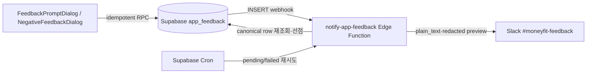

# MoneyFit 1.2.7 — 방해하지 않는 인앱 의견 모달 구현 계획

> 작성일: 2026-07-21 (KST)  
> 범위: 구현 계획만 작성. 앱 코드, 의존성, lockfile, DB는 이 문서에서 변경하지 않는다.

## 0. 결론과 권장 기본값

문의 폼을 다시 띄우는 것이 아니라, **성공적으로 지출을 기록한 뒤 바텀시트가 완전히 닫힌 자연스러운 시점**에 한 개의 자유 입력 모달을 가끔 보여준다. 유형 선택과 이메일은 받지 않는다. 질문은 “MoneyFit에 바라는 점이 있나요?” 하나이고, 본문은 3~1,000자로 받는다.

1.2.7의 권장 기본값은 다음과 같다.

| 항목 | 결정값 | 이유 |
|---|---:|---|
| 앱 내 fallback | `enabled=false`, rollout `0%` | Remote Config 이상이나 설정 누락 때 갑자기 전 사용자에게 노출하지 않는 안전 기본값 |
| 첫 단계 운영 rollout | stable cohort `5%` → `10%` | 불편·이탈·번역 문제를 먼저 확인 |
| 최소 설치 연령 | 7일 | 현재 리뷰 프롬프트의 2일보다 충분히 늦게 요청 |
| 최소 완료 세션 | 3회 | 첫 사용/온보딩/권한 요청과 분리 |
| 최소 의미 행동 | 성공한 **신규 지출 등록 10회**, 서로 다른 3일 이상 | 실제 가치를 경험한 사용자에게만 질문. 편집·검증 실패는 제외 |
| 표시 기회 | 신규 지출 저장 성공 후, 폼이 닫히고 화면이 안정된 때 | 입력 도중·저장 직전·화면 전환 도중 표시 금지 |
| 세션/일 상한 | 세션당 1회, 로컬 날짜당 1회 | 재시작·연속 등록에도 반복 노출 방지 |
| 다른 리뷰/전면 UI와 간격 | 마지막 선제적 리뷰·권한·광고 종료 후 120초, 리뷰와는 30일 | 연속 팝업 금지 |
| `나중에` | 30일 snooze | “가끔”이라는 기대에 맞춤 |
| 바깥 탭/뒤로가기/닫기 | 14일 snooze | 명시적 거절보다 가볍게 처리하되 다음 행동에서 즉시 재노출하지 않음 |
| `다시 보지 않기` | 의견 요청만 영구 opt-out | 문의 메뉴와 앱스토어 리뷰 기능에는 영향 없음 |
| 제출 성공 | 120일 snooze | 의견을 냈는데 곧바로 다시 묻지 않음 |
| 반복 노출 상한 | rolling 180일 동안 최대 3회 | 장기 사용자에게는 다시 물을 수 있지만 단기 피로를 제한 |

전 사용자에게 무작위로 매번 확률을 굴리지 않는다. 기기별 `0..9999` bucket을 한 번 생성해 SharedPreferences에 저장하고 Remote Config rollout 임계값과 비교한다. 같은 사용자는 같은 cohort에 남아야 노출률과 효과를 해석할 수 있다. 1차 실험 동안 treatment cohort는 전용 의견 모달만, control cohort는 기존 리뷰 프롬프트만 받는 **상호 배타 cohort**로 둔다.

## 1. 저장소 조사 결과

### 1.1 기존 리뷰 유도 흐름

`lib/core/services/review_prompt_service.dart::ReviewPromptService`는 싱글턴이며 `ExpenseAddForm`에서만 호출된다.

- `minInstallAge`는 2일이다.
- `maybePromptReview()`를 처음 호출할 때 `review_first_run_at`을 만든다. 따라서 이 값은 실제 설치 시각이 아니라 **첫 지출 등록 시점 또는 해당 코드가 배포된 뒤 첫 호출 시점**일 수 있다.
- 같은 프로세스에서는 `_requestedThisSession`으로 한 번만 시도한다.
- `review_opted_out`, `review_snooze_until`은 eligibility에 사용한다.
- `review_last_prompt_at`, `review_prompt_count`는 쓰기만 하고 eligibility에서 사용하지 않는다. 사용자가 첫 질문을 닫으면 `_markPrompted()`도 호출되지 않으므로 다음 앱 세션에서 다시 뜰 수 있다.
- 긍정 응답은 앱스토어 리뷰로 보내고, `later`는 7일 snooze, `never`는 영구 opt-out이다.
- 부정 응답은 `app_feedback`에 `uid`, `detail`, `platform`을 직접 INSERT한다.
- `submitNegativeFeedback()`는 모든 예외를 삼키고 성공 여부를 반환하지 않는다. DB 저장이 실패해도 감사 다이얼로그가 뜨는 데이터 유실 위험이 있다.

`lib/core/widgets/review_system/`의 현재 4개 다이얼로그와 역할은 다음과 같다.

| 파일/다이얼로그 | 역할 | 새 설계에서의 처리 |
|---|---|---|
| `experience_binary_dialog.dart::ExperienceBinaryDialog` | 만족/불만족 첫 질문 | 리뷰 흐름에 유지하되 coordinator lease 안에서만 표시 |
| `positive_confirm_dialog.dart::PositiveConfirmDialog` | 스토어 리뷰, later, never | 전체 리뷰 체인이 끝날 때까지 같은 lease 유지 |
| `negative_feedback_dialog.dart::NegativeFeedbackDialog` | 최대 300자 부정 피드백 | 새 repository를 재사용하고 실제 DB 성공 때만 감사 표시 |
| `thanks_dialog.dart::ThanksDialog` | 저장 감사 안내 | 새 의견 모달은 별도 성공 상태를 쓰되 스타일·접근성 패턴 공유 가능 |

`review_dialog_factory.dart::ReviewDialogFactory`가 네 다이얼로그를 `showDialog()`로 연속 호출한다. 현재는 다른 다이얼로그나 광고가 열려 있는지를 확인하는 공통 장치가 없다.

### 1.2 지출 저장과 광고/리뷰 호출 순서

`lib/core/widgets/expense_management/expense_add_form.dart::_handleSubmit()`의 현재 순서는 다음과 같다.

```text
InterstitialAdManager.logActionAndShowAd()
  -> 입력 재검증
  -> widget.onSubmit(expense)   // 반환형이 void라 async caller 완료를 기다리지 않음
  -> ReviewPromptService.maybePromptReview(context)
  -> Navigator.pop(bottom sheet)
```

문제는 세 가지다.

1. 광고가 저장 전 입력 폼 위에 뜰 수 있다.
2. `onSubmit` 타입이 `void Function(Expense)`라 `HomeActionButtons`의 async 저장 완료를 await하지 않는다. 실제 저장이 끝나기 전에 리뷰 또는 새 의견 요청이 시작될 수 있다.
3. 리뷰 다이얼로그가 아직 열린 지출 바텀시트의 context 위에 표시된다. 여기에 새 의견 모달을 추가하면 광고 → 리뷰 → 의견의 연속 전면 UI가 될 수 있다.

전면 광고는 `lib/core/services/ad_service.dart::InterstitialAdManager`가 메모리의 행동 12회와 10분 cooldown만 사용한다. `CalendarCell`, `MainBottomNavBar`, `ExpenseAddForm`이 각각 독립 호출한다. `AppOpenAdManager`는 구현돼 있으나 `app_initializer.dart`에서 선로딩이 주석 처리되어 현재 실사용하지 않는다. 광고 빈도 계획에서 app-open을 켜더라도 의견/리뷰/권한 화면과 같은 상호배제 장치를 사용해야 한다.

알림 권한 다이얼로그는 `HomeScreen.didChangeDependencies()`의 post-frame callback과 `NotificationService.showNotificationDialog()`에서 별도로 `showDialog()`를 호출한다. 업데이트 화면/권한/광고/리뷰/의견 중 어떤 것이 활성 상태인지 공유하지 않는다.

### 1.3 문의와 의견의 현재 저장 경로

두 저장 목적은 분리되어 있다.

| 사용자 흐름 | 테이블 | 현재 payload | 특성 |
|---|---|---|---|
| 설정 → 문의하기, `ContactUsDialog` | `user_contact` | `uid`, 번역된 `inquiry_type`, `email`, `details`, `platform` | 회신 가능한 고객 문의 |
| 리뷰 유도 → 불만족, `ReviewPromptService` | `app_feedback` | `uid?`, `detail`, `platform` | 회신 없는 제품 피드백 |

새 모달은 이메일·문의 유형을 요구하지 않는 제품 의견이므로 `user_contact`에 섞지 않고 **`app_feedback`을 확장**한다. `source=proactive_prompt`와 `source=review_negative`를 고정 코드로 구분한다. 화면 번역문을 DB 코드로 저장하지 않는다.

저장소에는 `supabase/` 디렉터리, migration, Edge Function, 실제 `app_feedback`/`user_contact` DDL과 RLS가 없다. 운영 스키마를 확인하지 않은 채 추정 SQL을 적용해서는 안 된다. `pubspec.yaml`의 `.env`는 앱 asset이므로 Slack Webhook, service-role key 같은 비밀은 절대 넣지 않는다.

### 1.4 SharedPreferences와 다국어

- `main.dart`는 SharedPreferences 인스턴스를 Riverpod으로 override하지만 `ReviewPromptService`는 매번 `SharedPreferences.getInstance()`를 직접 호출한다. clock/prefs를 주입할 수 없어 eligibility 단위 테스트가 어렵다.
- 지원 ARB는 정확히 14개다: `ko`, `en`, `es`, `pl`, `uk`, `cs`, `de`, `it`, `ro`, `sk`, `bg`, `id`, `ms`, `fil`.
- 기존 리뷰용 11개 문자열과 문의용 문자열은 전 언어에 있지만, 새 목적에 맞는 “앱에 바라는 점”, 개인정보 주의, 재시도/요청 제한 문구는 없다.
- 생성된 `app_localizations_*.dart`를 직접 고치지 않고 14개 ARB를 수정한 뒤 `flutter gen-l10n`으로 생성한다.

## 2. 사용자 경험 명세

### 2.1 한 화면, 자유 입력

모달은 다음 요소만 둔다.

1. 제목: “MoneyFit에 바라는 점이 있나요?”
2. 설명: 작은 아이디어도 좋으며 자유롭게 적어 달라는 한 문장
3. 3~1,000자의 여러 줄 입력란. 카테고리와 이메일은 없음
4. “이름, 이메일, 계좌정보 등 개인정보는 적지 마세요.” 안내
5. 기본 버튼 `보내기`, 보조 버튼 `나중에`, 텍스트 버튼 `의견 요청 안 보기`
6. 닫기 버튼과 시스템 뒤로가기 허용

앱 리뷰 점수를 묻거나 먼저 만족/불만족을 고르게 하지 않는다. 좋은 점, 불편한 점, 기능 아이디어를 모두 같은 자유 입력으로 받는다. 제출 내용의 감정에 따라 앱스토어 리뷰로 유도하지 않는다.

### 2.2 액션별 상태 전이

| 결과 | 로컬 상태 | 서버 상태 | 다음 노출 |
|---|---|---|---|
| `submit` 성공 | `last_submitted_at`, `snooze_until=+120d`, submit count | `app_feedback` commit 완료 | 최소 120일 후 다시 eligibility 평가 |
| `submit` 실패 | shown/day 상태만 유지, submitted로 기록 금지 | 없음 또는 idempotent 기존 행 | 다이얼로그와 입력을 유지하고 재시도 |
| `later` | `snooze_until=+30d` | 없음 | 30일 후 |
| `never` | `feedback_prompt_opted_out=true` | 없음 | 자동 의견 요청 영구 중단 |
| 빈 입력 제출 | 상태 변경 없음 | 호출 없음 | 인라인 validation |
| 닫기/바깥 탭/뒤로가기 | `snooze_until=+14d` | 없음 | 14일 후 |

입력 후 닫으려 할 때는 `PopScope`로 “작성 중인 내용을 버릴까요?”를 한 번 확인한다. 빈 입력이면 즉시 닫는다. `never`는 **제품 의견 모달에만** 적용하며 설정의 문의하기, 리뷰 작성 메뉴, 알림에는 적용하지 않는다.

## 3. 노출 정책과 중앙 상호배제

### 3.1 eligibility 순서

`FeedbackPromptService.evaluate()`는 다음 순서로 순수하게 판정하고 `eligible` 또는 stable한 suppress reason을 반환한다.

```text
remote enabled/rollout cohort
  -> opted_out가 아님
  -> install age >= 7일
  -> completed sessions >= 3
  -> successful new expense creates >= 10
  -> 의미 행동이 서로 다른 local date >= 3일
  -> snooze_until 경과
  -> rolling 180일 show count < 3
  -> 이번 세션/오늘 아직 표시·기회 평가 안 함
  -> 마지막 review/feedback prompt 후 30일 경과
  -> route가 home이고 앱 foreground, navigator 안정 상태
  -> 중앙 coordinator가 비어 있고 마지막 선제적 fullscreen 종료 후 120초 경과
```

의미 행동은 repository/Notifier가 신규 지출 저장 성공을 확인한 뒤에만 증가시킨다. 편집, 삭제, 폼 validation 실패, DB 실패, 같은 버튼 연타, 광고 클릭은 세지 않는다. 거래 이름·금액·카테고리는 prompt 상태나 analytics에 저장하지 않는다.

날짜 역행이나 기기 시간 조작으로 음수 duration이 나오면 즉시 eligibility로 만들지 말고 보수적으로 cooldown을 유지한다. Remote Config 숫자는 앱에서 clamp한다: install 3~60일, 의미 행동 5~100회, cooldown 7~365일, rollout 0~100%.

### 3.2 세션과 설치 시각

- `app_first_run_at`은 `app_initializer.dart`에서 앱 초기화 때 한 번 생성한다. 지출 등록 때 만들지 않는다.
- 기존 사용자는 `review_first_run_at`이 있으면 one-time migration에서 더 이른 신뢰 가능한 값으로 복사한다. 키가 없으면 1.2.7 첫 실행 시각을 사용한다. 과거의 실제 설치일은 복구할 수 없으므로 기존 사용자도 최대 7일 늦게 받는 안전한 쪽을 택한다.
- 세션은 foreground 진입부터 30분 이상 background 또는 프로세스 종료까지로 정의한다. `app_session_count`는 시작 시 한 번만 증가한다.
- 의미 행동 날짜는 `yyyy-MM-dd` local date 목록을 최대 30개만 저장한다. locale 변경과 무관한 숫자 포맷을 사용한다.

### 3.3 SharedPreferences 키

Riverpod으로 주입된 prefs와 test clock을 사용하는 `PromptStateRepository`를 만든다.

| 키 | 타입 | 용도 |
|---|---|---|
| `app_first_run_at` | ISO-8601 UTC string | 실제 앱 초기화 기준 설치 연령 |
| `app_session_count` | int | 완료/시작 세션 gate |
| `app_last_session_started_at` | ISO-8601 UTC string | 30분 세션 경계 |
| `engagement_prompt_last_shown_at` | ISO-8601 UTC string | 리뷰와 의견 공통 30일 cooldown |
| `engagement_prompt_last_kind` | `review\|feedback` | 충돌 분석과 migration |
| `feedback_prompt_bucket_v1` | int 0..9999 | stable rollout cohort |
| `feedback_prompt_opted_out` | bool | 의견 요청 영구 거절 |
| `feedback_prompt_snooze_until` | ISO-8601 UTC string | later/dismiss/submit cooldown |
| `feedback_prompt_last_shown_at` | ISO-8601 UTC string | 제품 의견 마지막 표시 |
| `feedback_prompt_show_history` | JSON UTC timestamp list | rolling 180일 최대 3회 계산, 오래된 값 제거 |
| `feedback_prompt_last_opportunity_day` | `yyyy-MM-dd` | 같은 날 반복 평가 방지 |
| `feedback_meaningful_action_count` | int | 성공 신규 지출 수 |
| `feedback_meaningful_action_days` | JSON local-date list | 서로 다른 3일 gate |
| `feedback_prompt_last_submitted_at` | ISO-8601 UTC string | 성공 제출 후 120일 gate/운영 확인 |

본문이나 작성 중 draft는 SharedPreferences에 저장하지 않는다. 개인정보가 평문 preference/backup에 남는 것을 피한다.

### 3.4 중앙 coordinator 설계

새 `lib/core/services/prompt_coordinator.dart`에 최소한의 전면 UI mutex를 둔다.

```dart
enum PromptSurface {
  notificationPermission,
  review,
  productFeedback,
  interstitialAd,
  appOpenAd,
}

abstract interface class PromptLease {
  PromptSurface get surface;
  void release(); // idempotent
}
```

`PromptCoordinator.tryAcquire(surface)`는 **첫 await 전에 동기적으로** active surface를 선점하고, 실패하면 queue를 만들지 않고 `busy:<surface>`를 반환한다. stale context에서 나중에 갑자기 뜨는 것을 막기 위해 선제적 prompt는 재예약하지 않는다. lease는 모든 exit path에서 `finally`로 해제한다.

- `ReviewPromptService.maybePromptReview()`는 첫 이분화 질문부터 감사 다이얼로그까지 전체 체인 동안 하나의 `review` lease를 유지한다.
- `HomeScreen._showNotificationDialog()`와 `NotificationService.showNotificationDialog()`는 `notificationPermission` lease를 사용한다.
- `InterstitialAdManager`/`AppOpenAdManager`는 광고 `show()` 호출 때 lease를 얻고 `onAdDismissedFullScreenContent`와 `onAdFailedToShowFullScreenContent`에서 해제한다. Google Mobile Ads의 `show()` Future 완료만으로 lease를 풀지 않는다.
- 새 의견 모달은 `productFeedback` lease를 사용한다.
- 강제 업데이트/UMP 동의처럼 앱 사용을 막는 흐름은 별도의 최고 우선 gate다. 이 화면이 활성인 동안 coordinator는 어떤 선제적 prompt/ad도 허용하지 않는다.

우선순위는 `사용자 직접 요청/강제 gate > 권한 > 리뷰·의견 > 광고`다. 한 의미 행동에서 리뷰/의견 eligibility를 먼저 평가하고 둘 다 없을 때만 전면 광고 opportunity를 실행한다. 의견이나 리뷰가 표시된 경우 광고 행동 count는 지우지 않고 다음 자연스러운 전환점까지 미룬다. 광고를 닫은 직후 의견을 이어 띄우지 않는다.

### 3.5 리뷰와 의견의 cohort 분리

1차 rollout 동안 사용자를 stable하게 나눈다.

- `control`: 기존 리뷰 프롬프트 대상. 제품 의견 모달은 표시하지 않는다.
- `feedback_v1`: 새 의견 모달 대상. 같은 실험 기간에는 기존 리뷰 프롬프트를 표시하지 않는다.

이렇게 해야 앱스토어 리뷰 전환 저하와 의견 제출 효과를 함께 비교할 수 있고 한 사용자에게 유사 질문을 두 번 하지 않는다. 실험 종료 후에는 coordinator가 `engagement_prompt_last_shown_at` 기준으로 더 오래 overdue인 한 종류만 선택하되, 공통 30일 cooldown은 유지한다.

## 4. 파일·심볼 단위 구현 계획

### 4.1 새 파일

| 파일 | 책임 |
|---|---|
| `lib/core/services/prompt_coordinator.dart` | 모든 선제적 다이얼로그/전면 광고 lease, session mutex, quiet period |
| `lib/core/repositories/prompt_state_repository.dart` | 위 SharedPreferences 키, one-time review key migration, clock 주입 |
| `lib/core/services/feedback_prompt_service.dart` | RC config clamp, cohort/eligibility, 상태 전이, safe-point 표시 |
| `lib/core/repositories/feedback_repository.dart` | 익명 auth 보장, idempotent Supabase RPC, typed 성공/실패 반환 |
| `lib/core/models/feedback_submission.dart` | `source`, client submission ID, stable payload. UI 번역문과 본문 외 사용자 데이터 금지 |
| `lib/core/widgets/feedback_system/feedback_prompt_dialog.dart` | 자유 입력, validation, loading/error/retry, later/never/dismiss result |
| `lib/core/config/feedback_prompt_config.dart` | Remote Config key/default/min/max의 단일 정의 |
| `test/core/services/feedback_prompt_service_test.dart` | eligibility/state/cohort/clock 단위 테스트 |
| `test/core/services/prompt_coordinator_test.dart` | 동시 lease, release, 광고 callback 상호배제 테스트 |
| `test/core/repositories/feedback_repository_test.dart` | auth, payload, idempotent retry, 오류 mapping |
| `test/core/widgets/feedback_prompt_dialog_test.dart` | 입력·키보드·접근성·14 locale widget 테스트 |

Riverpod provider는 각 service 파일 또는 `lib/core/providers/prompt_providers.dart` 한 곳에 둔다. UI에서 singleton 정적 인스턴스를 직접 읽지 않게 하여 fake로 교체 가능하게 한다.

### 4.2 기존 파일

| 파일·심볼 | 구체 변경 |
|---|---|
| `lib/core/widgets/expense_management/expense_add_form.dart::onSubmit` | 타입을 `Future<void> Function(Expense)`로 변경하고 실제 저장을 await. 내부 광고/리뷰 호출 제거. 성공 시 `ExpenseSubmitOutcome.created/updated`로 바텀시트를 먼저 닫음 |
| `lib/features/home/widgets/home_action_buttons.dart` | `await showModalBottomSheet<ExpenseSubmitOutcome>()`; `created`이고 parent context가 mounted일 때 의미 행동 기록 후 단 하나의 engagement/ad opportunity 실행 |
| `lib/core/widgets/today_expense_list.dart` | 편집 폼의 async callback도 await 가능한 새 시그니처로 변경. `updated`는 의견 의미 행동으로 세지 않음 |
| `lib/core/services/review_prompt_service.dart` | prefs/repository/coordinator/analytics 주입. `_requestedThisSession`을 중앙 상태로 대체. `last_prompt_at`을 실제 eligibility에 반영. feedback repository의 `source=review_negative`를 사용하고 실패 시 감사 표시 금지 |
| `lib/core/widgets/review_system/review_dialog_factory.dart` | 다이얼로그 자체가 lease를 따로 잡지 않게 하고, 전체 chain을 service의 한 lease로 감쌈 |
| review system 4개 다이얼로그 | 동작은 유지하되 large text/긴 번역 overflow와 back-dismiss 상태를 검증. 결과 `null`도 dismiss cooldown으로 기록 |
| `lib/features/home/view/home_screen.dart::_showNotificationDialog` | coordinator gate/lease 사용. 권한 모달 활성 중 리뷰·의견·광고 금지 |
| `lib/core/services/notification_service.dart::showNotificationDialog` | 설정/다른 진입점도 같은 coordinator 사용. 이미 열린 경우 두 번째 dialog를 만들지 않음 |
| `lib/core/services/ad_service.dart` | 광고 계획의 frequency policy와 별개로 coordinator lease 연동. prompt active/busy면 `suppress_reason=fullscreen_ui_busy`; dismiss/fail에서 반드시 release |
| `lib/core/services/app_initializer.dart` | 공용 Remote Config service에서 feedback defaults/fetch, install/session state 초기화. `UpdateService`/광고/feedback이 각자 settings를 덮어쓰지 않음 |
| `lib/main.dart` | prefs, clock, analytics, coordinator provider override/초기화. UI 표시 전 install state 준비 |
| `lib/l10n/app_*.arb` 14개 | 아래 14개 key 추가 후 생성 파일 재생성 |
| `lib/core/analytics/analytics_event.dart` | Amplitude 계획의 canonical feedback event/property enum 추가 |

저장 완료 → 폼 닫힘 → parent safe point → coordinator 판단이라는 순서를 단일 기준으로 만든다. `Future.delayed()`만으로 바텀시트가 닫혔다고 가정하지 말고 `showModalBottomSheet` Future 완료와 다음 frame을 기준으로 한다.

## 5. Remote Config

광고 계획과 같은 공용 Remote Config 초기화 계층을 사용한다.

| 키 | 앱 내 기본값 | 운영 초기값 | clamp/설명 |
|---|---:|---:|---|
| `feedback_prompt_enabled` | `false` | `true` | 즉시 kill switch |
| `feedback_prompt_rollout_percent` | `0` | `5` | 0..100, stable bucket 기준 |
| `feedback_prompt_min_install_days` | `7` | `7` | 3..60 |
| `feedback_prompt_min_sessions` | `3` | `3` | 2..30 |
| `feedback_prompt_min_actions` | `10` | `10` | 5..100 |
| `feedback_prompt_min_active_days` | `3` | `3` | 2..14 |
| `feedback_prompt_global_cooldown_days` | `30` | `30` | 리뷰/의견 공통, 7..365 |
| `feedback_prompt_later_days` | `30` | `30` | 7..365 |
| `feedback_prompt_dismiss_days` | `14` | `14` | 3..90 |
| `feedback_prompt_submitted_days` | `120` | `120` | 30..365 |
| `feedback_prompt_max_shows_180d` | `3` | `3` | 1..6 |
| `proactive_fullscreen_quiet_seconds` | `120` | `120` | user-initiated UI는 제외, 30..600 |
| `feedback_prompt_policy_version` | `feedback_v1` | `feedback_v1` | event/DB에 stable version 기록 |

fetch 실패 시 캐시된 활성값을 쓰고, 캐시도 없으면 off다. config 값만으로 이미 열린 모달을 강제 종료하지 않고 다음 opportunity부터 반영한다. kill switch를 끄면 새 모달만 멈추며 저장된 의견과 문의 메뉴는 유지한다.

## 6. Supabase, RLS, Slack 연계

### 6.1 운영 스키마 확인이 선행

Slack 문의 계획과 동일하게 Supabase CLI로 운영 스키마를 pull하고 다음을 확인한다.

- `app_feedback`의 실제 PK, 컬럼 nullability/default, RLS/policy/GRANT
- 기존 행의 빈 `detail`, null `uid`, platform 분포
- 익명 로그인 세션이 INSERT 때 항상 준비되어 있는지
- `user_contact` Slack migration과 공통화 가능한 delivery 필드/Edge Function 구조

기준을 확보한 뒤 `supabase/migrations/<timestamp>_extend_app_feedback.sql`과 `supabase/functions/notify-app-feedback/index.ts`를 버전 관리한다.

### 6.2 `app_feedback` additive 확장

기존 1.2.6 payload를 깨지 않는 additive migration을 사용한다.

| 필드 | 제안 | 용도 |
|---|---|---|
| `id` | uuid PK/default | Slack, 재시도, 운영 식별. 기존 PK가 있으면 재사용 |
| `uid` | uuid, legacy 기간 nullable | 새 RPC는 `auth.uid()`로 강제, 구버전 호환 뒤 not null 검토 |
| `source` | text default `review_negative` | `review_negative\|proactive_prompt`; 구버전 생략을 리뷰 피드백으로 분류 |
| `detail` | text | 원문. 신규 RPC는 trim 후 3~1,000자 |
| `platform` | `ios\|android\|other` | 현재 필드 유지 |
| `locale` | text nullable | 14개 language code allowlist |
| `app_version`, `build_number` | text nullable | 회귀 추적 |
| `prompt_policy_version` | text nullable | `feedback_v1` |
| `client_submission_id` | uuid nullable + unique partial index | 네트워크 응답 유실 후 재시도 중복 방지 |
| `created_at` | timestamptz default `now()` | 서버 접수 시각 |
| Slack delivery 필드 | `status/attempts/next_retry/notified_at/last_error_code` | 문의 Slack 계획과 같은 at-least-once 재시도 패턴 |

기존 `NegativeFeedbackDialog`는 빈 문자열도 보낼 수 있으므로 테이블 전체에 즉시 `detail >= 3` CHECK를 걸면 구버전이 깨진다. 새 `submit_app_feedback` RPC에서 강하게 검증하고, 구버전 점유율이 충분히 낮아진 뒤 별도 migration으로 테이블 제약을 강화한다. 과거 행은 `slack_status=suppressed`로 backfill해 배포 순간 Slack으로 쏟아지지 않게 한다.

### 6.3 RPC, RLS, 중복 방지

신규 앱은 직접 INSERT 대신 제한된 `submit_app_feedback(...)` RPC를 사용한다.

- auth session이 없으면 앱 repository가 익명 로그인을 완료한 뒤 호출한다.
- RPC는 전달받은 UID를 신뢰하지 않고 `auth.uid()`를 사용한다.
- `source`, locale/platform allowlist, 본문 길이, client ID를 검증한다.
- `(auth.uid(), client_submission_id)` unique로 동일 재시도를 기존 성공으로 반환한다.
- `SECURITY DEFINER`를 쓴다면 고정 `search_path`, 완전 수식 table name, execute role 제한을 필수로 한다.
- 앱 role은 자기 의견 INSERT/RPC만 가능하고 SELECT/UPDATE/DELETE는 불가하다.
- Slack 상태 같은 운영 컬럼은 column GRANT 또는 trigger로 클라이언트가 위조하지 못하게 한다.
- 구버전 직접 INSERT policy는 호환 기간 동안만 유지하고, 신버전 채택률 확인 후 제거한다.
- UID별 서버 rate limit 권장값은 24시간 3건, 30일 10건이다. 정상 의견은 DB에 남기되 반복 spam이 Slack을 폭주시킬 수 없게 한다.

### 6.4 Slack 알림 계획과 연결

데이터 흐름은 다음과 같다.



`01_slack_inquiry_alert.md`의 `user_contact → DB Webhook → Edge Function → Slack` 패턴, secret 보관, 조건부 선점, 429/5xx backoff, Cron 회수, plain-text escaping을 재사용한다. 구현 시 문의 notifier가 이미 generic하게 만들어졌다면 handler를 공유하고 `table/source` adapter만 나눈다. 그렇지 않으면 문의 코드를 복사하기보다 공통 `notification_delivery` helper를 추출한다.

- 사용자에게 보이는 제출 성공은 **DB commit 성공** 기준이다. Slack 장애는 성공 UX를 실패로 바꾸지 않는다.
- Slack에는 feedback ID, source, 서버 시각, platform, locale, app version, 안전한 본문 preview만 보낸다.
- raw UID는 보내지 않고 짧은 hash/부분 식별자만 쓴다.
- `@channel`, `<mailto:...>`, URL 같은 사용자 입력을 `mrkdwn`에 넣지 않는다.
- PII 의심 시 Slack 본문을 `[개인정보 가능성 — Supabase에서 권한 있는 운영자만 확인]`으로 대체한다.
- Incoming Webhook의 한계상 Slack 성공 직후 DB 상태 갱신 전에 함수가 죽으면 드물게 중복될 수 있다. 메시지에 feedback ID를 표시해 식별한다.

문의(`user_contact`)와 의견(`app_feedback`)은 별도 레코드이므로 한 사용자 액션에서 둘 다 INSERT하지 않는다. 새 의견 모달이 `ContactUsDialog`를 호출하는 방식도 금지한다.

## 7. 스팸, 욕설, PII, 오프라인/실패 UX

### 7.1 자유로운 표현과 moderation

- 14개 언어의 욕설 blacklist를 앱에 넣어 제출을 차단하지 않는다. 오탐이 많고 우회가 쉬우며 “자유로운 의견” 목적과 충돌한다.
- 욕설이 있어도 합법적인 제품 의견이면 DB에는 접수한다. 서버에서 `normal\|suspected_spam\|abusive\|pii_suspected`로 운영 분류하고 Slack preview/채널 라우팅만 조절한다.
- URL 반복, 동일 본문 hash 반복, 비정상 속도, UID rate limit을 서버에서 검사한다. 클라이언트 제한만 신뢰하지 않는다.
- 외부 moderation API를 쓰면 원문이 추가 처리자에게 전달되므로 개인정보처리방침/처리 지역/보존 조건을 먼저 검토한다. 1차는 rate limit + PII heuristic + Slack plain text로 시작하는 것이 안전하다.

### 7.2 PII와 보존

- 입력란 위에 이름, 이메일, 전화번호, 계좌·카드정보를 쓰지 말라는 안내를 항상 표시한다.
- 의견 모달은 이메일을 별도 필드로 받지 않는다. 회신이 필요하면 설정의 문의하기를 사용하도록 성공 화면에서만 안내할 수 있다.
- analytics에는 본문, 본문 hash, 이메일, 정확한 UID를 event property로 보내지 않는다.
- DB 원문 권한은 운영 최소 인원으로 제한한다. 권장 보존은 DB 365일 후 삭제/익명화, Slack preview 90일이며 실제 정책과 워크스페이스 설정을 맞춘다.
- Privacy Policy, Apple App Privacy, Google Play Data Safety에 자유 텍스트/가명 UID/Slack 처리 목적과 보존을 반영한다.

### 7.3 네트워크 실패

- connectivity 상태를 선제적으로 믿지 않는다. 실제 RPC 결과로 성공/실패를 판단한다.
- 전송 중 버튼을 disable하고 progress를 표시한다. client submission ID는 다이얼로그 수명 동안 유지해 retry가 중복 행을 만들지 않게 한다.
- timeout/5xx/네트워크 실패 시 모달을 닫지 않고 원문을 메모리에 유지하며 “다시 시도”와 “나중에”를 제공한다.
- rate limit이면 별도 문구를 보여주고 성공으로 가장하지 않는다.
- 앱 종료를 넘는 offline queue나 SharedPreferences draft는 1.2.7에 넣지 않는다. 민감한 자유 텍스트를 평문으로 장기 저장하는 위험이 이득보다 크다.
- 기존 `ReviewPromptService`처럼 예외를 삼킨 뒤 감사 화면을 띄우는 동작은 제거한다.

## 8. Amplitude 연계

`03_amplitude_setup.md`의 `AnalyticsService` facade, consent, sanitizer, Title Case event 규칙을 따른다. feedback 코드에서 `amplitude_flutter`나 `firebase_analytics`를 직접 import하지 않는다. analytics 실패가 eligibility, 제출, Slack 전달을 막아서는 안 된다.

| 이벤트 | 발생 시점 | 허용 속성 |
|---|---|---|
| `Feedback Prompt Opportunity` | control/treatment가 safe point에 도달 | `variant`, `eligible`, `suppress_reason`, `policy_version`, `trigger=expense_created` |
| `Feedback Prompt Shown` | 실제 dialog가 화면에 열린 뒤 | `variant`, `policy_version`, `install_age_bucket`, `action_count_bucket`, `session_count_bucket` |
| `Feedback Prompt Responded` | `submit\|later\|never\|dismiss` 선택 | `action`, `policy_version`, `visible_duration_bucket` |
| `Feedback Submitted` | Supabase commit 성공 | `source=proactive_prompt\|review_negative`, `length_bucket`, `attempt_count_bucket` |
| `Feedback Submission Failed` | 최종 RPC attempt 실패 | `source`, `error_category=network\|timeout\|auth\|rate_limited\|server\|validation\|unknown`, `attempt_count_bucket` |

`suppress_reason`은 최소 `remote_disabled`, `control_cohort`, `opted_out`, `install_age`, `session_count`, `action_count`, `active_days`, `snoozed`, `daily_cap`, `session_cap`, `rolling_cap`, `review_cooldown`, `fullscreen_busy`, `quiet_period`, `unsafe_route`를 enum으로 고정한다. 번역된 문자열을 event/property로 쓰지 않는다.

본문 길이는 `3_49`, `50_149`, `150_499`, `500_1000`처럼 bucket으로만 보내고 원문·hash·첫 문장·키워드는 보내지 않는다. analytics 동의를 하지 않은 사용자에게는 위 이벤트가 0건이어야 하지만 의견 제출 자체는 정상 동작해야 한다.

## 9. 14개 신규 번역 키와 14개 언어 작업

기존 generic `confirm`, `cancel`, `pleaseWait`는 재사용한다. 새 목적이 모호해지지 않도록 아래 **14개 키**는 의견 모달 전용으로 추가한다.

| # | ARB key | 한국어 기준 문구 | 영어 기준 문구 |
|---:|---|---|---|
| 1 | `feedback_prompt_title` | MoneyFit에 바라는 점이 있나요? | What would you like to see in MoneyFit? |
| 2 | `feedback_prompt_body` | 작은 아이디어도 좋아요. 더 나아졌으면 하는 점을 자유롭게 알려주세요. | Even a small idea helps. Tell us what could make MoneyFit better. |
| 3 | `feedback_prompt_hint` | 예: 반복 지출을 더 쉽게 입력하고 싶어요. | Example: I’d like an easier way to add recurring expenses. |
| 4 | `feedback_prompt_privacy_hint` | 이름, 이메일, 계좌정보 등 개인정보는 적지 마세요. | Please don’t include personal information such as your name, email, or account details. |
| 5 | `feedback_prompt_send` | 보내기 | Send feedback |
| 6 | `feedback_prompt_later` | 나중에 | Maybe later |
| 7 | `feedback_prompt_never` | 의견 요청 안 보기 | Don’t ask for feedback again |
| 8 | `feedback_prompt_empty_error` | 바라는 점을 입력해 주세요. | Please enter your feedback. |
| 9 | `feedback_prompt_too_short_error` | 3자 이상 입력해 주세요. | Please enter at least 3 characters. |
| 10 | `feedback_prompt_submit_error` | 보내지 못했어요. 내용을 유지했으니 다시 시도해 주세요. | We couldn’t send it. Your text is still here—please try again. |
| 11 | `feedback_prompt_retry` | 다시 시도 | Try again |
| 12 | `feedback_prompt_rate_limited` | 의견을 너무 자주 보냈어요. 잠시 후 다시 시도해 주세요. | You’ve sent feedback too frequently. Please try again later. |
| 13 | `feedback_prompt_thanks` | 알려주셔서 감사합니다. 제품 개선에 참고할게요. | Thanks for helping us improve MoneyFit. |
| 14 | `feedback_prompt_discard_confirm` | 작성 중인 내용을 버릴까요? | Discard what you’ve written? |

적용 대상 파일은 `app_ko.arb`, `app_en.arb`, `app_es.arb`, `app_pl.arb`, `app_uk.arb`, `app_cs.arb`, `app_de.arb`, `app_it.arb`, `app_ro.arb`, `app_sk.arb`, `app_bg.arb`, `app_id.arb`, `app_ms.arb`, `app_fil.arb`이다.

번역 절차는 영어/한국어 product copy 확정 → 12개 언어 번역 → back-translation/placeholder 검수 → `flutter gen-l10n` → key parity 자동 검사 순서로 한다. 독일어·우크라이나어처럼 긴 문구, 필리핀어/말레이어의 자연스러운 존칭, “never”가 앱 전체 알림 거절로 오해되지 않는지를 별도로 검수한다.

## 10. 접근성, 키보드, 긴 다국어 UI

- `Dialog` 안을 `SafeArea + ConstrainedBox(maxHeight: 화면의 85%) + SingleChildScrollView`로 구성한다.
- `MediaQuery.viewInsets.bottom`을 반영하는 `AnimatedPadding` 또는 동일 효과를 사용해 키보드가 버튼/오류 문구를 가리지 않게 한다.
- 텍스트 필드는 `minLines=3`, `maxLines=6`, `maxLength=1000`, `textInputAction=newline`, autofocus false로 시작한다. 모달이 뜨자마자 키보드를 강제로 열지 않는다.
- 버튼을 고정 `Row`에 넣지 않는다. 긴 번역과 200% text scaling에서 세로 배치/`Wrap`으로 바뀌고, 텍스트를 읽을 수 없을 정도로 축소하지 않는다.
- 최소 터치 영역 48x48dp, theme contrast, focus traversal 순서를 제목 → 설명 → 입력 → 보내기 → 나중에 → never → 닫기로 검증한다.
- screen reader에 제목, 글자 제한, validation error, 전송 중, 전송 성공을 semantic/live region으로 알린다. 장식 아이콘은 semantics에서 제외한다.
- system back과 ESC, Android 뒤로가기, iOS VoiceOver escape를 지원한다. 입력이 있으면 discard confirm으로 이동한다.
- 320x568 작은 화면, landscape, 200% text scale, 키보드 표시, light/dark, 14개 locale에서 overflow가 없어야 한다.
- RTL 지원 언어는 현재 없지만 방향을 하드코딩하지 않고 `Directionality`를 따른다.

## 11. 테스트 계획

### 11.1 단위 테스트

- 6일/7일 설치 연령 경계, 2/3세션, 9/10행동, 2/3 active day를 fake clock으로 검증한다.
- later 30일, dismiss 14일, submit 120일, never 영구 상태 전이를 검증한다.
- rolling 180일 3회, 세션 1회, 하루 1회, 리뷰 공통 30일 cooldown을 검증한다.
- stable bucket이 재시작 후 유지되고 rollout 5→10% 확대 때 기존 treatment가 빠지지 않는지 검증한다.
- RC 음수/과대/잘못된 타입, fetch 실패, clock rollback, timezone 변경을 보수적으로 처리하는지 검증한다.
- 리뷰와 의견이 동시에 eligible이어도 cohort별 하나만 선택되는지 검증한다.
- `PromptCoordinator.tryAcquire()` 동시 호출에서 정확히 하나만 성공하고 release가 idempotent인지 검증한다.
- 광고 show Future가 끝나도 dismiss callback 전에는 lease가 유지되는지 검증한다.

### 11.2 widget/golden 테스트

- 빈 값, 공백만, 2자, 3자, 1,000자, 1,001자, emoji/조합문자/개행을 검증한다.
- submit 연타가 repository를 한 번만 호출하고 retry가 같은 client submission ID를 쓰는지 검증한다.
- 성공 때만 닫힘/감사 표시, 실패 때 입력 보존, rate-limit 전용 문구를 검증한다.
- 빈 입력 dismiss와 작성 중 dismiss confirm, later/never 반환값을 검증한다.
- 모든 14 locale에서 key 누락/overflow/버튼 접근 가능 여부를 순회한다.
- 320x568, landscape, text scale 2.0, 키보드 inset, dark mode golden을 만든다.
- semantics tree에 제목·입력 설명·오류·loading 상태가 중복 없이 들어가는지 확인한다.

### 11.3 흐름 통합 테스트

1. 신규 지출 DB 저장 성공 전에는 의미 행동/프롬프트가 발생하지 않는다.
2. 성공 후 바텀시트가 먼저 닫히고 home에서 최대 한 개의 전면 UI만 열린다.
3. 광고 threshold와 의견 eligibility가 동시에 맞으면 의견 하나만 표시되고 광고가 이어 뜨지 않는다.
4. 리뷰 cohort에서는 기존 4개 다이얼로그 체인이 동작하고 새 의견 모달은 0회다.
5. 알림 권한, 업데이트, UMP, app-open/interstitial 활성 중에는 의견이 suppressed되고 stale queue가 나중에 뜨지 않는다.
6. dialog가 열린 동안 앱 background/foreground, route 이동, widget dispose가 발생해도 setState/Navigator 예외가 없다.

### 11.4 Supabase/Slack 테스트

- 운영 clone/local Supabase에서 migration과 구버전 3-field payload 호환을 검증한다.
- auth A가 자기 feedback RPC 가능, 타 UID 위조/SELECT/UPDATE/DELETE/운영 필드 위조는 불가해야 한다.
- 0/2/3/1,000/1,001자, 허용하지 않은 source/locale/platform을 테스트한다.
- 같은 `client_submission_id` 직렬·동시 재시도가 행과 Slack 알림을 하나만 만드는지 검증한다.
- Slack 200/400/403/404/429/500/timeout에서 DB commit은 보존되고 delivery 상태/backoff가 맞는지 검증한다.
- `@channel`, Slack markup, URL, 이메일/전화/계좌 유사 문자열, 한글/라틴/키릴/emoji 1,000자를 보내 멘션·로그 PII 유출이 없는지 확인한다.
- migration 전 과거 `app_feedback`이 Slack으로 일괄 전송되지 않는지 확인한다.

검증 명령은 구현 PR에서 최소 `dart format --set-exit-if-changed lib test`, `flutter gen-l10n`, `flutter analyze`, `flutter test`를 통과해야 한다. ARB JSON parse, 14개 key parity, generated getter 존재 여부도 CI에 추가한다.

## 12. 성공 지표와 가드레일

Amplitude 동의 사용자 지표와 Supabase 서버 집계를 분리해 본다. 제출 원문은 제품 분석 대시보드로 보내지 않는다.

### 성공 지표

- primary: `Feedback Submitted / Feedback Prompt Shown` ≥ 5%
- secondary: 유효한 중복 제거 의견 ≥ 3건 / 1,000 treatment MAU
- 80% 이상의 성공 제출이 한 번의 RPC attempt로 완료
- 수집 의견 중 제품팀이 분류 가능한(non-empty/non-spam) 비율 ≥ 85%
- locale/platform별 표본이 충분할 때 특정 군의 submit failure가 전체 대비 2배 이상 치우치지 않음

### 반드시 지킬 가드레일

- 모달 노출 뒤 30초 이내 세션 종료율: control 대비 증가 `<= 1.0%p`
- D7 retention: control 대비 하락 `<= 0.5%p` 또는 통계적 유의한 악화 없음
- `never` 선택률 `< 20%`; 20% 이상이면 문구/타이밍/빈도 재검토
- prompt 관련 crash/Flutter error `0`, RPC technical failure `< 2%`
- 앱스토어 리뷰 완료 proxy: control 대비 상대 하락 `< 10%`
- 광고 impressions/DAU: coordinator로 인한 상대 하락 `< 2%`; 이보다 크면 prompt 우선순위/다음 opportunity 정책 조정
- 알림 권한 opt-in과 첫 지출 완료율은 기존 cohort 대비 악화 없음
- Slack 중복 `< 1%`, PII 원문이 Slack으로 노출된 확인 사고 `0건`

표본이 작을 때 retention만 보고 성급히 승자를 정하지 않는다. 최소 7일, 가능하면 주중/주말을 포함한 14일을 관찰하고 제출 원문의 질을 수동 표본 검토한다.

## 13. 단계적 릴리즈와 롤백

### 배포 순서

1. 운영 Supabase schema/RLS 백업과 migration 기준 확보.
2. `app_feedback` additive migration, RPC, Edge Function, 개발 Slack 채널을 먼저 배포. 과거 행 suppressed 확인.
3. Amplitude event schema와 dashboard, Remote Config defaults/kill switch를 준비.
4. 앱 코드에서 async 저장 순서와 coordinator를 먼저 적용하고 기존 리뷰/알림/광고 회귀 테스트.
5. 14개 번역 및 접근성 QA.
6. 내부 QA bucket만 enable해 Android/iOS 실제 기기에서 DB → Slack을 확인.
7. production `1%` 24시간 → `5%` 72시간 → `10%` 7일 → 가드레일 충족 시 `25%` 순서. 50~100%는 리뷰 전환과 의견 품질을 본 뒤 별도 결정.

### 롤백

- 즉시: `feedback_prompt_enabled=false` 또는 rollout `0`. 앱 업데이트 없이 신규 표시를 멈춘다.
- Slack 장애: app-feedback notifier/Webhook만 끄고 DB 저장은 유지한다. 복구 뒤 pending batch를 재시도한다.
- Analytics schema 오류: Amplitude ingestion block/feature event kill switch를 사용하되 의견 기능은 유지한다.
- 앱 crash/내비게이션 오류: store phased rollout 중단 후 hotfix. DB/RPC는 additive 상태로 남겨 구버전과 호환한다.
- 이미 받은 feedback을 rollback 과정에서 삭제하지 않는다. 정책에 따른 보존/삭제만 수행한다.

Remote Config disable을 앱 UI 버그의 유일한 보호막으로 보지 않는다. fallback off, coordinator 단위 테스트, staged rollout을 함께 사용한다.

## 14. 구현 완료 체크리스트

- [ ] 실제 `app_feedback` DDL/RLS/기존 데이터 형태를 확인했다.
- [ ] `ExpenseAddForm.onSubmit`이 Future를 await하고 저장 성공 후 폼이 먼저 닫힌다.
- [ ] review system 4개 다이얼로그, 알림 권한, interstitial/app-open, 의견 모달이 같은 coordinator를 사용한다.
- [ ] 한 safe point에서 광고/리뷰/의견 중 하나만 표시되고 연속 팝업이 없다.
- [ ] 7일/3세션/10행동/3 active day, 세션·일·30일·180일 cap이 테스트됐다.
- [ ] later/never/submit/dismiss 상태와 legacy review key migration이 테스트됐다.
- [ ] 새 의견은 `app_feedback.source=proactive_prompt`, 기존 부정 리뷰는 `review_negative`로 저장된다.
- [ ] 제출 실패 때 감사 화면이 뜨지 않고 입력과 동일 client submission ID가 유지된다.
- [ ] Slack 실패가 앱 제출 성공을 뒤집지 않고, retry/중복/PII redaction이 동작한다.
- [ ] Amplitude에 본문·hash·이메일·거래 데이터·번역문이 없다.
- [ ] 14개 신규 key가 14개 ARB 모두에 있고 생성/분석/테스트가 통과한다.
- [ ] 작은 화면, 키보드, 200% text scale, dark mode, 14 locale 접근성 QA를 통과한다.
- [ ] RC kill switch, staged rollout, dashboard alert와 담당자가 준비됐다.

## 15. 핵심 위험

1. **현재 저장 완료를 await하지 않는다.** 이 순서를 먼저 고치지 않으면 실패한 지출 뒤에도 의견 모달이 뜨고 provider 오류가 유실될 수 있다.
2. **현재 리뷰 저장은 실패를 성공처럼 보인다.** 새 repository를 공용화하면서 반드시 성공/실패를 typed result로 반환해야 한다.
3. **독립 `showDialog()`와 광고 호출이 이미 여러 곳에 흩어져 있다.** 새 모달만 자체 boolean으로 막으면 notification/app-open/interstitial과 race가 남는다.
4. **실제 Supabase schema/RLS가 저장소에 없다.** 운영 DDL을 확인하기 전 migration/RPC/Slack 설계를 확정 배포하면 구버전 INSERT 중단이나 데이터 노출 위험이 있다.
5. **14개 언어의 `never`/PII 문구 오역은 opt-out·신뢰에 직접 영향**을 준다. 단순 기계 번역 후 출시하지 않는다.
6. **Slack은 PII의 추가 복제본**이다. raw text 전체 전송보다 redacted preview, 짧은 보존, 최소 채널 권한을 기본으로 한다.
7. **리뷰 요청과 제품 의견 요청은 서로 KPI를 잠식할 수 있다.** stable exclusive cohort와 공통 30일 cooldown 없이 전체 rollout하지 않는다.
