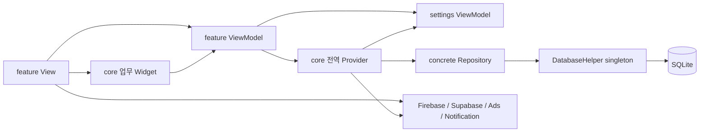
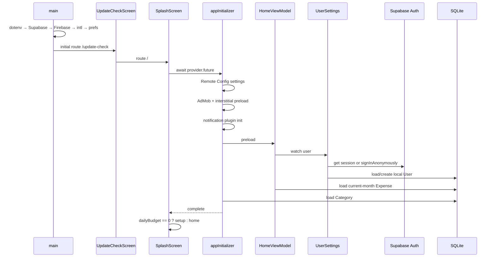
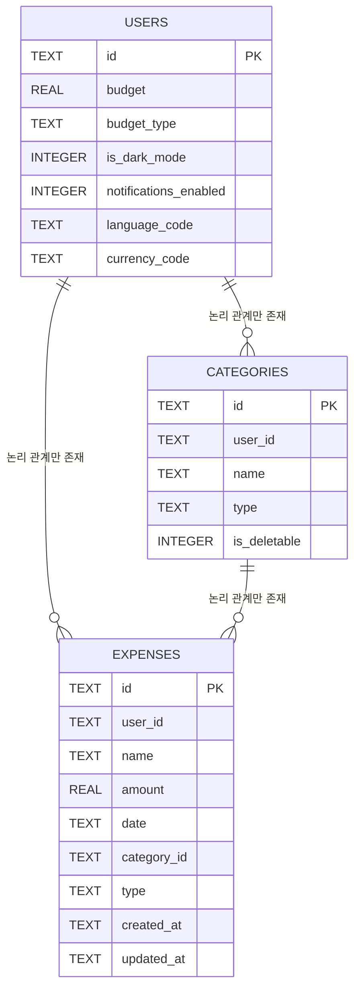
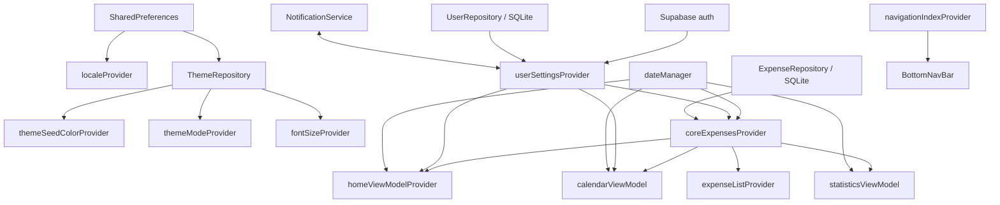

# 현재 아키텍처: 코드가 실제로 동작하는 방식

> 분석 기준: 2026-07-21 / main 4ebbddd  
> 이 문서는 README나 과거 설계 의도가 아니라 현재 실행 가능한 소스 코드를 기준으로 작성했다.

## 1. 한 문장 판정

MoneyFit은 디렉터리 이름만 보면 Feature-first MVVM이지만, 실제 실행 구조는 **core가 도메인 모델·저장소·전역 상태·업무 위젯을 소유하고 각 feature가 이를 조합하는 core-centric hybrid**다.

현재 구조를 축약하면 다음과 같다.



폴더 경계와 의존성 경계가 일치하지 않기 때문에, 기능 폴더를 분리해 둔 효과가 제한된다. 특히 Expense와 Category의 실제 소유자는 features/expense가 아니라 core다.

## 2. 기술·실행 기준선

| 구분 | 현재 선택 |
| --- | --- |
| UI | Flutter Material 3 |
| 상태 관리 | Riverpod 2.x의 Provider, StateNotifierProvider, AsyncNotifierProvider, FutureProvider 혼용 |
| 로컬 영속성 | sqflite SQLite v5 |
| 작은 설정 저장 | SharedPreferences |
| 세션·문의 | Supabase anonymous auth 및 직접 insert |
| 분석·업데이트 | Firebase Analytics, Remote Config |
| 수익화 | Google Mobile Ads |
| 알림 | flutter_local_notifications, permission_handler, timezone |
| 라우팅 | go_router의 GoRoute + ShellRoute |
| 다국어 | Flutter gen-l10n |
| 앱 재시작 | flutter_phoenix |

[pubspec.yaml](../../../pubspec.yaml#L32-L64)은 UI 앱이 직접 사용하는 외부 SDK를 모두 단일 패키지에 둔다. 현재 지원 의도가 명확한 플랫폼은 Android와 iOS다. Windows scaffold는 남아 있지만 [firebase_options.dart](../../../lib/firebase_options.dart)는 Windows 구성을 지원하지 않고, SQLite·광고·알림 경로도 모바일 전제를 갖는다.

## 3. 물리적 디렉터리와 실제 책임

```text
lib/
├── main.dart
├── core/
│   ├── config/          locale/currency metadata
│   ├── database/        SQLite schema, migration, seed, reset
│   ├── functions/       UI helper + formatting + budget calculation + URL launch
│   ├── models/          User, Expense, Category, ThemeSettings
│   ├── providers/       DB/repository + global expense/date/locale/theme/category state
│   ├── repositories/    User/Expense/Category/Theme persistence
│   ├── router/          all feature route composition
│   ├── services/        ads, startup, reset, notification, review, update
│   ├── theme/           active and deprecated theme systems
│   └── widgets/         expense CRUD UI, ads, review, update, shared UI
├── features/
│   ├── auth/            splash only
│   ├── calendar/        calendar projection and screen
│   ├── expense/         list/filter projection and screen
│   ├── home/            dashboard projection and screen
│   ├── onboarding/      budget setup + unreachable onboarding
│   ├── settings/        user/session/preferences/notification/reset/feedback UI
│   └── statistics/      statistics projection and screen
├── widgets/             bottom navigation, notification dialog
└── l10n/               ARB source + generated localizations
```

### 이름과 소유권이 어긋나는 대표 사례

| 기능 개념 | 현재 실제 소유 위치 | 결과 |
| --- | --- | --- |
| Expense entity/serialization | [core/models/expense_model.dart](../../../lib/core/models/expense_model.dart) | expense feature가 자기 핵심 모델을 소유하지 못함 |
| Expense CRUD/query/cache | [core/repositories/expense_repository.dart](../../../lib/core/repositories/expense_repository.dart), [core/providers/expenses_provider.dart](../../../lib/core/providers/expenses_provider.dart) | 모든 화면이 하나의 전역 월 상태에 결합 |
| Expense 입력·수정 UI | [core/widgets/expense_management](../../../lib/core/widgets/expense_management) | core가 feature 전용 UI를 보유 |
| Category entity/CRUD/UI | core/models, core/repositories, core/providers, core/widgets | ledger aggregate가 네 디렉터리로 분산 |
| 현재 날짜/선택 월/선택 일 | [core/providers/select_date_provider.dart](../../../lib/core/providers/select_date_provider.dart) | 서로 다른 UI 관심사가 동일 상태를 덮어씀 |
| 세션·예산·알림·locale | [features/settings/viewmodel/user_settings_provider.dart](../../../lib/features/settings/viewmodel/user_settings_provider.dart) | settings ViewModel이 앱 전역 사용자 aggregate 역할까지 수행 |
| 앱 조립 | [core/router/app_router.dart](../../../lib/core/router/app_router.dart) | 가장 바깥 composition root가 core 내부에 위치 |

## 4. 앱 부팅과 첫 화면 결정

### 4.1 현재 부팅 순서

[main.dart](../../../lib/main.dart#L18-L41)의 부팅은 직렬이다.

1. Flutter binding을 초기화한다.
2. .env asset을 읽는다.
3. SUPABASE_URL과 SUPABASE_ANON_KEY를 강제 언래핑해 Supabase를 초기화한다.
4. Firebase를 초기화한다.
5. 모든 locale date formatting을 초기화한다.
6. SharedPreferences instance를 만든다.
7. Phoenix → ProviderScope → MyApp 순서로 앱을 실행한다.

MaterialApp이 만들어진 뒤에도 [MyApp build](../../../lib/main.dart#L51-L91)가 userSettingsProvider를 listen해 과거 User.isDarkMode를 ThemeSettings로 마이그레이션한다. 즉, 데이터 migration side effect가 앱 root의 build lifecycle에 들어 있다.

라우터 초기 위치는 /update-check다. 업데이트 검사 화면을 거쳐 /의 SplashScreen으로 이동하고, SplashScreen은 [appInitializerProvider](../../../lib/core/services/app_initializer.dart#L12-L52)를 기다린다.



### 4.2 critical path에 묶인 것

첫 화면 진입이 반드시 필요로 하는 것은 로컬 설정, 로컬 사용자/예산, SQLite schema와 해당 월 데이터다. 그러나 Splash가 기다리는 appInitializer에는 다음 선택 기능도 직렬 await로 포함된다.

- AdMob 초기화와 전면 광고 preload
- notification plugin/timezone 초기화
- Home preload가 간접 수행하는 Supabase anonymous authentication
- Home의 현재 월 Expense query와 Category의 전체 category query

[SplashScreen](../../../lib/features/auth/view/splash_screen.dart#L21-L41)은 이 체인에서 위로 전파된 오류를 원인별로 구분하지 않고 /budget_setup으로 보낸다. 따라서 “예산이 없는 신규 사용자”와 “광고 SDK 초기화 실패”, “오프라인 Supabase 인증 실패”, “DB 손상”이 같은 화면으로 표현될 수 있다.

Remote Config에는 이와 다른 두 경로가 있다.

- appInitializer의 설정 오류는 내부 try/catch가 삼키므로 budget setup으로 전파되지 않는다.
- Splash보다 먼저 실행되는 [UpdateCheckScreen](../../../lib/core/widgets/update_check_screen.dart#L23-L25)은 전체 _run을 감싸는 오류 처리가 없다. fetchAndActivate 자체는 service가 삼키지만 PackageInfo, 설정, 그 밖의 오류가 나면 _checking이 true인 채 update 화면에 머물 수 있다.

또한 .env load, Supabase.initialize, Firebase.initializeApp, intl, SharedPreferences는 runApp보다 먼저 실행되고 바깥 error boundary가 없다. 이 구간이 실패하면 Flutter route 자체가 만들어지지 않아 budget setup이나 recovery 화면에도 도달하지 못한다.

즉 현재 startup failure는 모두 한 곳으로 수렴하는 것이 아니라, 일부는 앱 UI가 뜨기 전에 중단되고, 일부는 잘못된 onboarding으로 수렴하고, 일부는 update gate에서 정지하며, 일부는 조용히 무시된다.

### 4.3 현재 onboarding 판정

별도의 onboarding 상태가 없다. HomeState가 없거나 dailyBudget이 0이면 budget setup으로 이동한다. 이는 presentation projection을 세션/설정 완료 여부의 source of truth로 사용한다. [onboarding_screen.dart](../../../lib/features/onboarding/view/onboarding_screen.dart)는 route가 주석 처리돼 현재 main graph에서 도달하지 않는다.

## 5. 라우팅과 탭 상태

[app_router.dart](../../../lib/core/router/app_router.dart#L19-L119)는 모든 feature 화면을 import하고 다음 경로를 구성한다.

| 경로 | 역할 |
| --- | --- |
| /update-check | 강제/선택 업데이트 검사 |
| / | startup splash |
| /budget_setup | 최초 예산 설정 |
| /home | 홈 |
| /calendar | 달력 |
| /stats | 통계 |
| /expense_list | 내역 |
| /settings | 설정 |

GoRouter에는 redirect나 protected-route guard가 없다. 따라서 /home, /calendar, /stats, /expense_list, /settings를 initial location/deep link로 직접 열면 /update-check와 Splash의 initializer/setup 판정을 우회한다. provider가 화면에서 lazy load될 수는 있어도 강제 업데이트와 setup gate는 보장되지 않는다.

하단 다섯 탭은 ShellRoute 하나 아래 있지만 각 branch navigator를 갖는 StatefulShellRoute가 아니다. [bottom_nav_bar.dart](../../../lib/widgets/bottom_nav_bar.dart#L125-L154)는 다음 일을 동시에 수행한다.

- navigationIndexProvider를 직접 변경
- 전역 dateManager를 DateTime.now()로 초기화
- 1·2·3번 탭 진입 광고 side effect 실행
- route 문자열 switch로 context.go 호출

route가 이미 선택 탭 정보를 갖는데 별도의 index state가 있으므로 deep link, browser/back navigation, programmatic navigation 시 둘이 어긋날 수 있다. 탭 전환은 각 탭의 navigator stack과 화면 내부 상태를 보존하지 않으며, 다른 기능에서 고른 날짜도 강제로 오늘로 바꾼다.

## 6. 핵심 데이터 모델

### 6.1 User

[User](../../../lib/core/models/user_model.dart#L3-L107)는 다음 네 관심사를 한 record에 합친다.

- Supabase/local identity: id, email, displayName
- 예산: budget, budgetType
- 앱 preference: deprecated isDarkMode, notificationsEnabled, languageCode, currencyCode
- persistence metadata: createdAt, updatedAt

이 모델은 domain entity이면서 SQLite row DTO다. UserSettingsNotifier가 Supabase 세션 생성, local User 생성/수정, 예산, 알림 스케줄, locale, reset까지 관리한다.

### 6.2 Expense

[Expense](../../../lib/core/models/expense_model.dart#L4-L81)는 domain entity, form 결과, SQLite DTO를 동시에 맡는다.

| 필드 | 현재 의미와 제약 |
| --- | --- |
| id | widget이 UUID를 생성 |
| userId | Supabase anonymous user ID를 local ownership key로 사용 |
| amount | double ↔ SQLite REAL |
| date | DateTime이지만 저장은 YYYY-MM-DD 문자열 |
| categoryId | FK 선언 없는 문자열 |
| type | Category.type과 중복 저장 |
| createdAt/updatedAt | widget 또는 caller가 직접 생성 |
| currency | 필드 없음; 현재 선택 통화로 과거 금액까지 표시 |

fromJson의 알 수 없는 type은 ExpenseType.n으로 바뀐다. 손상된 값이 명시적 migration/error가 아닌 정상 enum처럼 흘러간다.

### 6.3 Category

[Category](../../../lib/core/models/category_model.dart#L7-L61)는 기본 category와 사용자 category를 nullable userId로 구분한다. Expense가 categoryId와 type을 모두 가지므로 category type 변경 또는 잘못된 ID에서 정합성이 깨질 수 있다. nullable field를 명시적으로 null로 바꿀 수 없는 copyWith 형태도 사용한다.

### 6.4 ThemeSettings

ThemeSettings는 SharedPreferences의 JSON DTO이면서 Flutter Color 변환 책임도 가진다. [theme_provider.dart](../../../lib/core/providers/theme_provider.dart#L20-L154)의 seed color, dark mode, font size 세 notifier가 동일 JSON blob을 각자 load-modify-save 한다.

## 7. SQLite 구조와 저장 흐름

### 7.1 schema

[DatabaseHelper](../../../lib/core/database/database_helper.dart#L8-L255)는 singleton connection, schema 생성, v1→v5 migration, category seed, 전체 DB 삭제를 한 class가 소유한다.



위 관계는 코드가 기대할 뿐 SQLite FOREIGN KEY로 선언돼 있지 않다. index, amount/type CHECK constraint, PRAGMA foreign_keys 활성화도 없다. 월 조회는 date LIKE 'YYYY-MM%'이고 사용자·날짜 복합 index가 없어 데이터 증가 시 full scan 가능성이 있다.

v3 migration의 type UPDATE는 입력값과 출력값이 같아 실질적으로 no-op다. v4·v5 migration과 기존 데이터 보존 여부를 검증하는 fixture test는 없다.

### 7.2 월 지출 읽기

```text
Home / Calendar / Statistics / ExpenseList
  → coreExpensesProvider
  → ExpenseRepository.getExpensesByMonth(userId, year, month)
  → SQLite rows
  → Expense.fromJson
  → Map<DateTime, List<Expense>>
  → CoreExpensesNotifier._cache["year-month"]
```

[ExpenseRepository](../../../lib/core/repositories/expense_repository.dart#L68-L104)는 query 또는 decoding 예외를 log한 뒤 빈 Map으로 바꾼다. “정상적으로 지출이 0건”과 “DB query 실패/데이터 손상”이 동일해진다.

[CoreExpensesNotifier](../../../lib/core/providers/expenses_provider.dart#L11-L151)는 다음 책임을 모두 가진다.

- 현재 선택 월 구독
- 사용자 조회
- 월 query
- 수동 multi-month cache
- 화면에 노출할 현재 월 state
- create/update/delete command
- Firebase Analytics event
- dateManager 변경

cache key는 year-month라 userId가 없다. 빈 Map이면 refreshExpensesFor가 false를 반환하고 선택 월/state를 바꾸지 않아 “지출 없는 달”로 정상 이동할 수 없다.

### 7.3 쓰기

추가 흐름은 다음 순서다.

```text
Expense form
  → View에서 Expense/UUID/timestamp 생성
  → HomeViewModel.addExpense
  → CoreExpensesNotifier.addExpense
  → SQLite INSERT
  → Firebase Analytics await
  → 현재 Map과 수동 cache 수정
```

SQLite insert가 성공하고 Analytics가 실패하면 DB에는 저장됐지만 provider state는 갱신되지 않는다. update/delete도 mutation 대상 월이 현재 state와 같다는 가정을 하며, 날짜가 다른 달로 변경될 때 old/new cache를 함께 무효화하지 않는다.

## 8. Riverpod 상태 그래프



### 상태별 실제 의미

| Provider | 현재 소유 상태 | 관찰 |
| --- | --- | --- |
| userSettingsProvider | 세션 사용자 + 예산 + locale/currency + 알림 | settings feature에 있지만 앱 전체 root dependency |
| coreExpensesProvider | 현재 월 Map + private 다중 월 cache + CRUD | user와 date에 결합 |
| dateManager | 오늘, 캘린더 선택일, 캘린더 월, 통계 월, 목록 필터 월 | 하나의 DateTime에 다섯 의미 |
| categoryProvider | category query/CRUD + localized display helper | BuildContext가 notifier에 침투 |
| localeProvider | SharedPreferences locale/currency | User SQLite의 동일 값과 중복 |
| theme seed/mode/font providers | 같은 ThemeSettings JSON의 부분 상태 | 병렬 저장 시 last-write-wins 위험 |
| navigationIndexProvider | 선택 탭 | router location과 중복 |

## 9. 기능별 현재 역할

### auth

실질적으로 SplashScreen 하나다. appInitializer를 기다리고 HomeState.dailyBudget으로 route를 결정한다. 인증 UI/도메인이 아니라 startup orchestration feature에 가깝다.

### onboarding

현재 도달 가능한 흐름은 BudgetSetupScreen뿐이다. 이 화면은 settings feature의 userSettingsProvider를 직접 사용한다. 기존 OnboardingScreen은 route가 주석 처리되어 미도달 상태다.

### home

[home_data_provider.dart](../../../lib/features/home/viewmodel/home_data_provider.dart)는 305줄 안에서 다음을 수행한다.

- 화면 state model과 spending level 선언
- Flutter Color 결정
- 현재 월/일 지출 집계
- 일·월 예산 환산
- 평균과 streak 계산
- Expense command forwarding
- daily/monthly 표시 mode 변경

loading branch는 완료되지 않는 Completer Future를 반환한다. display mode는 build 때 매번 daily로 초기화된다. 평균 분모는 실제 일수나 경과일이 아니라 expensesByDate의 key 수이고, streak는 선택 날짜가 아닌 DateTime.now를 사용하며 자율 지출 0원인 날을 실패 처리한다.

### calendar

core 월 Map을 CalendarCellData와 CalendarStat으로 투영한다. selected day/month도 dateManager를 공유한다. 성공일·연속일 계산 규칙은 Home과 별도 구현되어 “자율 지출 0원” 및 누락 날짜에 대한 의미가 다르다. CalendarHeader는 월 변경, 직접 fetch, snackbar, 광고까지 담당한다.

### statistics

월 Map을 category별 합계·순위·chart 데이터로 투영한다. [statistics.dart](../../../lib/features/statistics/view/statistics.dart)는 435줄 superfile이고 view 내부에 provider 선언과 상태 조작이 섞여 있다. expense feature의 presentation widget인 MonthYearPickerDialog를 직접 import한다.

### expense

이 기능은 ledger 자체가 아니라 list/filter presentation에 가깝다. 실제 entity, repository, CRUD state, form, category management는 core에 있다. ExpenseList state는 core state를 초기 copy한 뒤 필터링하므로 다른 화면 mutation 후 stale state가 될 수 있다.

### settings

화면 기능은 잘게 나뉘었지만 UserSettingsNotifier는 세션·local user·budget·notification·locale·reset을 함께 소유한다. theme은 core provider, locale은 또 다른 core provider, feedback dialog는 Supabase client를 직접 호출한다. 따라서 화면 하나에서 여러 source of truth를 순차 수정한다.

## 10. 외부 서비스 경계

| 서비스 | 현재 호출 위치 | 결합 문제 |
| --- | --- | --- |
| Supabase Auth | UserSettingsNotifier | local ledger 첫 진입까지 network session에 의존 |
| Supabase inquiry | ContactUsDialog | View가 backend schema와 client를 직접 앎 |
| Firebase Analytics | router observer, CoreExpensesNotifier, reset/review/ads | 업무 command 성공 여부에 analytics 실패가 영향을 줄 수 있음 |
| Remote Config | UpdateService + appInitializer | 설정·fetch 책임 중복 |
| AdMob | appInitializer, BottomNav, CalendarHeader, form/review | navigation/UI와 수익화 정책 결합 |
| Notifications | NotificationService + UserSettingsNotifier + setting widget | service가 BuildContext, WidgetRef, l10n, user state를 역참조 |
| Store/URL | functions, update/review/contact | 정책과 platform launch가 여러 파일에 분산 |

직접 singleton 접근이 많아 fake를 주입하기 어렵고, SDK failure와 domain failure를 분리하기 어렵다.

## 11. 의존성 방향

### 의도해야 하는 방향

```text
app composition → feature presentation → feature application → feature domain
                  feature data ───────────────────────────────→ domain
core는 어느 feature도 import하지 않는 leaf/shared foundation
```

### 실제 방향

정적 import 기준으로 core → features 직접 참조가 12개 있다. 7개는 router가 화면을 조립하기 위한 참조이고, 나머지는 실제 역방향 결합이다.

- core expenses provider → settings ViewModel
- core category provider → settings ViewModel
- notification service → settings ViewModel
- app initializer → home ViewModel
- core TodayExpenseList → home ViewModel

확인된 file-level cycle은 두 개다.

1. notification_service.dart ↔ user_settings_provider.dart
2. ad_service.dart ↔ ad_banner_widget.dart

feature 간에도 onboarding/auth/calendar/expense/home이 settings ViewModel을 참조하고, statistics presentation이 expense presentation을 참조한다.

이 구조에서 core는 “변하지 않는 공통 기반”이 아니라 모든 기능이 만나는 service locator 역할을 한다.

## 12. UI·테마 구조

활성 theme stack은 AppThemeColors, AppThemeGenerator, ThemeSettings, ThemeRepository, 세 theme notifier, 두 ThemeData provider로 구성된다. light/dark ThemeData가 대부분 중복 구현되어 [theme_provider.dart](../../../lib/core/providers/theme_provider.dart)가 382줄이다.

동시에 app_theme.dart와 design_palette.dart라는 과거 theme island가 남아 있다. main graph에서 도달하지 않는 448줄 규모다. responsive_text 아래에는 용도별로 거의 같은 wrapper 7개가 존재한다. review prompt는 service와 dialog/factory 5개로 750줄가량이며, 현재 제품 규모에 비해 상태·타입·파일이 많이 나뉘어 있다.

MaterialApp builder가 모든 route child를 SafeArea로 감싸고 개별 화면/하단 nav도 다시 SafeArea를 사용한다. 화면별 edge-to-edge 정책을 제어하기 어렵고 중복 inset 가능성이 있다.

## 13. 기존 문서와 코드의 차이

docs/learn 문서는 당시의 학습과 설계 의도를 이해하는 자료로는 가치가 있다. 다만 다음 항목은 현재 구현과 일치하지 않는다.

- Feature 응집도와 직접 참조가 해소됐다는 설명과 달리 core → feature 역참조와 cross-feature 참조가 남아 있다.
- FutureProvider.family와 invalidate 전략 문서와 달리 현재 월 지출은 CoreExpensesNotifier 내부 수동 Map cache다.
- UUID 전략 문서의 remote sync/email 흐름과 달리 Expense는 SQLite-only이고 사용자는 Supabase anonymous auth다.
- README의 Database → RepositoryProvider → CoreNotifier → ViewModel → View 설명은 SDK 직접 호출과 widget/service cycle을 표현하지 못한다.

따라서 기존 문서는 삭제 대상이 아니라 **역사/의도 문서**로 표시하고, 이 디렉터리의 문서를 현행 architecture baseline으로 삼는 것이 안전하다.

## 14. 현재 구조에서 유지할 것

리팩터링은 재작성 프로젝트가 아니다. 다음 기반은 살릴 수 있다.

- Riverpod AsyncValue를 이용한 loading/data/error 표현 기반
- repository 생성자 주입과 provider composition의 초기 형태
- 대부분의 SQLite query에서 whereArgs 사용
- UUID 식별자
- 최초 schema 생성 시 Batch 사용
- Home/Calendar/Statistics를 read projection으로 분리하려 한 방향
- ThemeSettings와 locale에 대한 비교적 많은 unit/widget test
- gen-l10n 기반 다국어와 theme extension

문제는 기술 선택보다 **업무 상태의 소유권과 의존성 방향**이다. 다음 문서에서는 이 구조가 만드는 실제 위험을 우선순위별로 분해한다.

다음: [02-findings.md](./02-findings.md)
