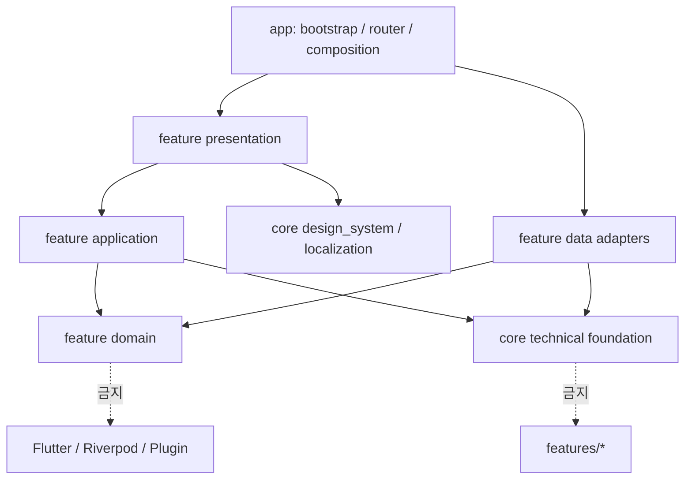
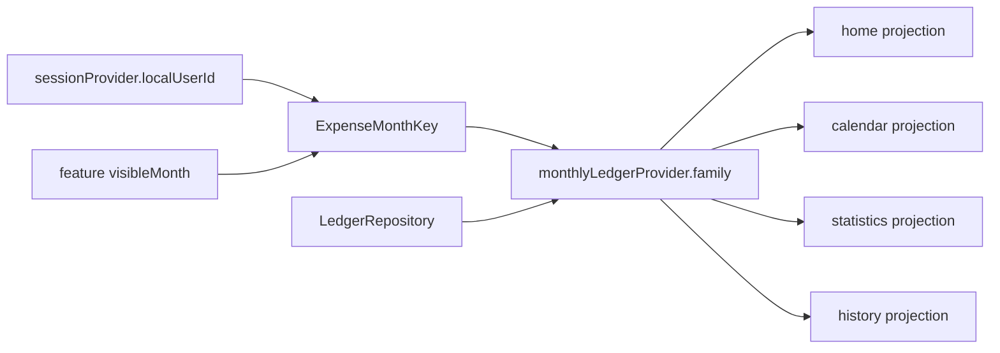
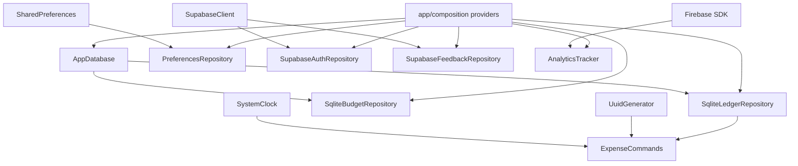

# 목표 아키텍처: Feature-first MVVM

## 1. 목표와 비목표

### 목표

1. 한 기능의 업무 규칙·상태·저장 책임이 그 기능 안에 모인다.
2. View → ViewModel/application → domain의 단방향 흐름을 만든다.
3. SQLite, Supabase, Firebase, AdMob, notification plugin은 교체 가능한 경계 뒤에 둔다.
4. 동일한 ledger 데이터가 Home·Calendar·Statistics에서 같은 규칙으로 해석된다.
5. empty, loading, failure를 구분하고 쓰기 후 어떤 query가 바뀌는지 명시한다.
6. clean checkout에서 재현 가능한 테스트가 경계를 보호한다.
7. 현재 Riverpod, SQLite, GoRouter를 유지해 불필요한 기술 교체를 피한다.

### 비목표

- 앱을 처음부터 다시 작성하지 않는다.
- 모든 CRUD마다 UseCase class를 하나씩 만들지 않는다.
- 모든 feature에 비어 있는 domain/data/application 폴더를 선제 생성하지 않는다.
- micro-package, dependency-injection framework, code generation을 구조 개선의 선행 조건으로 만들지 않는다.
- 서버 동기화가 없는 현재 ledger에 speculative sync engine을 만들지 않는다.
- LOC나 파일 수 자체를 품질 지표로 삼지 않는다.

목표는 “Clean Architecture 모양”이 아니라 **변경 이유가 한 경계에 닫히는 가장 작은 구조**다.

## 2. 핵심 원칙

### 2.1 소유자는 하나다

| 개념 | 단일 소유 feature |
| --- | --- |
| identity/session | session |
| Expense, Category, LedgerCurrency, 월 ledger query, CRUD | ledger |
| current budget와 계산 정책 | budget |
| 홈 projection | home |
| 캘린더 projection/selection | calendar |
| 통계 projection/filter | statistics |
| locale/theme/font preference | preferences |
| permission/schedule | notifications |
| feedback/inquiry | feedback |
| update policy | app_update |
| 광고 policy/adapter | monetization |
| 위 기능을 보여주는 설정 화면 | settings |

settings 화면이 preferences와 notifications를 보여줄 수는 있지만 그 domain state의 소유자는 아니다. Home이 Expense를 보여줄 수는 있지만 CRUD 구현의 소유자는 ledger다.

### 2.2 의존은 안쪽과 아래로만 간다



구체 규칙:

- core는 features를 import하지 않는다.
- feature의 domain은 Flutter, Riverpod, sqflite, Firebase, Supabase를 import하지 않는다.
- presentation은 같은 feature의 application/domain과 공통 design system만 본다.
- data는 domain contract를 구현하지만 presentation을 보지 않는다.
- 다른 feature를 참조할 때는 그 feature의 domain/application 공개 API만 사용한다.
- feature A의 view/widget이 feature B의 view/widget을 import하지 않는다.
- concrete adapter와 SDK instance를 연결하는 곳은 app composition이다.

AppDatabase는 connection과 transaction primitive만 소유한다. ledger/budget table의 현재 schema는 각 feature data가 소유하고, 여러 feature를 동시에 바꾸는 version migration 순서만 app/database/migrations가 조정한다. 따라서 core database가 feature Dart library를 역참조하지 않는다.

## 3. 목표 디렉터리

실제 책임이 생긴 파일만 만들며, 다음은 최종 방향을 보여주는 예시다.

```text
lib/
├── main.dart
├── app/
│   ├── app.dart
│   ├── bootstrap/
│   │   ├── bootstrap_controller.dart
│   │   └── bootstrap_state.dart
│   ├── composition/
│   │   ├── database_providers.dart
│   │   ├── platform_providers.dart
│   │   └── repository_providers.dart
│   ├── database/
│   │   └── migrations/       cross-feature version orchestration
│   ├── router/
│   │   ├── app_router.dart
│   │   ├── app_routes.dart
│   │   └── route_refresh_notifier.dart
│   └── shell/
│       └── app_shell.dart
├── core/
│   ├── database/
│   │   └── app_database.dart  connection/transaction primitive only
│   ├── error/
│   │   └── app_failure.dart
│   ├── foundation/
│   │   ├── clock.dart
│   │   ├── id_generator.dart
│   │   ├── local_date.dart
│   │   ├── money.dart
│   │   └── year_month.dart
│   ├── localization/
│   ├── design_system/
│   └── platform/
│       ├── analytics_tracker.dart
│       └── external_link_launcher.dart
└── features/
    ├── session/
    │   ├── domain/
    │   ├── data/
    │   └── application/
    ├── ledger/
    │   ├── domain/
    │   │   ├── expense_entry.dart
    │   │   ├── category.dart
    │   │   ├── ledger_repository.dart
    │   │   └── spending_policy.dart
    │   ├── data/
    │   │   ├── local/         ledger schema/query implementation
    │   │   ├── expense_row.dart
    │   │   ├── category_row.dart
    │   │   ├── ledger_mapper.dart
    │   │   └── sqlite_ledger_repository.dart
    │   ├── application/
    │   │   ├── ledger_queries.dart
    │   │   ├── expense_commands.dart
    │   │   ├── category_controller.dart
    │   │   └── ledger_providers.dart
    │   └── presentation/
    │       ├── editor/
    │       ├── history/
    │       └── categories/
    ├── budget/
    │   ├── domain/
    │   ├── data/
    │   ├── application/
    │   └── presentation/
    ├── home/
    │   ├── application/
    │   └── presentation/
    ├── calendar/
    │   ├── application/
    │   └── presentation/
    ├── statistics/
    │   ├── application/
    │   └── presentation/
    ├── preferences/
    ├── notifications/
    ├── feedback/
    ├── app_update/
    ├── monetization/
    └── settings/
        └── presentation/
```

Home·Calendar·Statistics는 자체 DB table이나 repository가 필요하지 않다. ledger와 budget을 읽어 만드는 projection이므로 application + presentation만으로 충분하다. 이것이 “모든 feature에 4계층”보다 단순하고 정확하다.

## 4. MVVM 역할 계약

### View

해야 하는 일:

- widget 렌더링
- TextEditingController, focus, animation 같은 transient UI state
- 사용자 intent를 ViewModel에 전달
- immutable UiState 구독
- SnackBar, dialog, pop 같은 일회성 UiEffect 소비

하지 않는 일:

- UUID/time/domain entity 생성
- SQLite/Supabase/Firebase/AdMob 직접 호출
- budget/streak/category aggregation 계산
- query cache 갱신
- repository exception 해석

### ViewModel / application

해야 하는 일:

- 화면에 필요한 immutable UiState 생성
- 입력 검증과 command 실행
- loading/saving/error 상태 전이
- domain policy와 repository 조합
- 성공 후 관련 query invalidation
- View가 수행할 one-off effect 발행

하지 않는 일:

- BuildContext, WidgetRef를 method parameter로 받기
- Flutter Color, Widget, localized display string 보관
- SDK singleton 직접 접근
- SQL row serialization

Riverpod Notifier 자체가 ViewModel 역할을 할 수 있다. ViewModel을 다시 감싸는 controller/use-case/provider 계층을 무조건 만들 필요는 없다.

### Model

MVVM의 Model은 단일 class가 아니라 두 부분이다.

- domain: ExpenseEntry, Category, Money, LedgerCurrency, CurrentBudget, SpendingPolicy, repository contract
- data: SQLite row DTO, mapper, concrete repository, Supabase/plugin adapter

domain entity는 toJson/fromJson을 가지지 않는다. data row가 snake_case와 SQLite type을 처리한다.

## 5. ledger가 갖는 vertical slice

ledger는 현재 core에 흩어진 Expense와 Category를 함께 소유한다.

### 5.1 domain

권장 모델:

```text
ExpenseEntry
  id: ExpenseId
  ownerId: LocalUserId
  title: String
  amount: Money
  occurredOn: LocalDate
  categoryId: CategoryId
  createdAt: Instant
  updatedAt: Instant

NewExpenseDraft
  title, amount, occurredOn, categoryId

ExpensePatch
  id, expectedOwnerId, title, amount, occurredOn, categoryId

Category
  id, ownerId, stableCode?, displayName?, spendingKind, isBuiltIn, archivedAt?
```

구분 이유:

- View는 아직 ID/timestamp가 없는 Draft를 제출한다.
- application command가 Clock과 IdGenerator로 entity를 완성한다.
- update는 existing entity를 읽어 createdAt을 보존하고 updatedAt만 바꾼다.
- LocalDate는 날짜-only 의미를 명시해 timezone 변환 실수를 막는다.
- Money는 minor unit과 장부의 LedgerCurrency를 함께 가져 숫자와 단위를 분리하지 않는다. 한 owner의 Expense와 Budget은 같은 LedgerCurrency만 사용한다.

Expense의 type 중복은 제거하는 것을 권장한다. Category.spendingKind는 category가 한 번 사용된 후 immutable하게 하고, 종류를 바꾸고 싶다면 새 category를 만든다. 과거 통계가 category 수정으로 뒤집히지 않는다.

만약 제품상 category kind 변경이 필수라면 Expense에 spendingKindSnapshot을 **의도적인 역사 snapshot**으로 저장하고 그 정책을 ADR로 남긴다. 현재처럼 우연히 두 필드를 중복 저장하는 상태는 피한다.

### 5.2 repository contract

contract는 실제 application 요구만 노출한다.

```dart
abstract interface class LedgerRepository {
  Future<MonthlyLedger> readMonth(ExpenseMonthKey key);
  Future<ExpenseEntry?> findExpense(ExpenseId id, LocalUserId ownerId);
  Future<void> insertExpense(ExpenseEntry expense);
  Future<void> replaceExpense(ExpenseEntry expense);
  Future<void> deleteExpense(ExpenseId id, LocalUserId ownerId);
  Future<List<Category>> readCategories(LocalUserId ownerId);
}
```

호출되지 않는 get-all 변형을 미리 만들지 않는다. 검색·기간 조회가 실제 요구가 되면 contract에 추가한다.

### 5.3 query state

월별 query identity는 반드시 사용자와 월을 포함한다.

```text
ExpenseMonthKey
  ownerId: LocalUserId
  month: YearMonth
```



provider는 다음 상태를 그대로 보존한다.

- loading
- data with empty entries
- data with entries
- error with typed failure

빈 달은 data이고 error가 아니다.

### 5.4 command와 invalidation

command는 query state와 분리한다.

```text
create draft
  → validate domain invariants
  → build ExpenseEntry with Clock/IdGenerator
  → repository insert
  → invalidate ExpenseMonthKey(owner, occurred month)
  → emit success effect
  → analytics best-effort

update patch
  → load existing row
  → preserve id/createdAt
  → repository replace
  → invalidate old month
  → invalidate new month if different
  → emit success effect

delete id
  → verify owner
  → repository delete exactly one row
  → invalidate original month
```

command provider의 state는 idle/saving/success/failure 또는 AsyncValue<void>면 충분하다. 월 Map을 command notifier 내부에서 손으로 patch하지 않고 repository commit 후 source query를 invalidate한다. optimistic update가 실제 UX 요구가 되기 전에는 추가하지 않는다.

Analytics는 DB commit 뒤 best-effort로 실행하고 UI 성공을 뒤집지 않는다.

### 5.5 category lifecycle

권장 정책:

- built-in category는 local user별 row로 materialize하고 stable code를 가지며, 이름은 l10n presentation에서 번역한다.
- custom category는 사용자가 입력한 display name을 저장한다.
- 사용 중인 category는 hard delete하지 않고 archive한다.
- 새 Expense에는 archived category를 선택할 수 없지만 과거 Expense는 계속 표시한다.
- built-in category는 삭제·종류 변경 불가다.

모든 category가 ownerId를 가지므로 Expense(ownerId, categoryId)가 같은 owner의 category만 참조하도록 composite FK로 강제할 수 있다. 이 정책은 FK ON DELETE RESTRICT와 잘 맞으며 cross-user 참조와 orphan Expense를 만들지 않는다.

## 6. Home·Calendar·Statistics는 projection이다

### 6.1 공통 SpendingPolicy

다음 규칙을 pure Dart service 하나에 둔다.

- daily/monthly budget 계산
- discretionary/essential 합계
- 성공일 정의
- 현재 streak와 최대 streak
- 평균의 분모: 달력 일수, 경과일, 기록일 중 어느 것인지
- 남은 금액과 threshold
- 미래 날짜/빈 날짜 처리
- 과거 budget plan 선택

UI 색상은 SpendingLevel을 theme color로 매핑하는 presentation 책임이다. domain은 Colors.green을 모른다.

정책 결정이 필요한 항목:

- 자율 지출 0원인 날을 성공으로 볼지
- 기록 자체가 없는 날을 성공/미참여/실패 중 무엇으로 볼지
- 오늘을 streak에 포함하는 시점
- 월 평균을 경과일로 나눌지 기록일로 나눌지

한 번 정하면 table-driven unit test로 고정한다.

### 6.2 projection 의존

```text
HomeViewModel
  watches MonthlyLedger + ActiveBudget + homeDay
  returns HomeUiState

CalendarViewModel
  watches MonthlyLedger + BudgetForMonth + calendarVisibleMonth
  owns calendarSelectedDay
  returns CalendarUiState

StatisticsViewModel
  watches MonthlyLedger + statisticsFilter
  returns StatisticsUiState

ExpenseHistoryViewModel
  watches MonthlyLedger/range + historyFilter
  returns ExpenseHistoryUiState
```

이 ViewModel들은 서로를 watch하지 않는다. 모두 ledger/budget의 공개 application/domain API에서 파생된다.

## 7. 날짜 상태

LocalDate와 YearMonth를 사용해 의미를 타입으로 분리한다.

| 상태 | owner | lifecycle |
| --- | --- | --- |
| today | Clock | mutable provider가 아닌 계산값 |
| homeDay | home | 화면 또는 앱 정책에 따라 유지 |
| calendarVisibleMonth | calendar | 탭 state와 함께 유지 |
| calendarSelectedDay | calendar | visible month와 별도 |
| statisticsMonth/filter | statistics | 해당 탭 안에서 유지 |
| historyFilter | ledger/history | expense list 화면이 소유 |

탭 전환이 이 값을 일괄 초기화하지 않는다. “오늘로 이동” 버튼이 명시적으로 해당 feature state만 변경한다.

## 8. session, budget, preferences 분리

### 8.1 session

현재 ledger가 원격 anonymous ID에 묶여 첫 실행 offline을 어렵게 한다. 현재 제품이 local-first인 만큼 다음을 권장한다.

```text
LocalUserId: 앱 설치/로컬 DB에서 즉시 생성되는 안정 ID
RemoteUserId: Supabase session이 있을 때만 존재
SessionLink: local ↔ remote mapping
```

ledger와 budget은 LocalUserId를 owner key로 사용한다. Supabase session은 feedback나 미래 sync에 필요할 때 연결한다. 네트워크가 없어도 기존 local ledger를 열 수 있다.

기존 v5 row의 id가 Supabase ID 형태여도 값을 즉시 재작성할 필요는 없다. 그 값을 legacy LocalUserId로 채택하고 remote mapping을 별도로 snapshot하면 offline 의미를 먼저 분리할 수 있다. 여러 local user row가 있어 owner를 결정할 수 없는 경우에만 recovery가 필요하다. 이 compatibility mapping은 Bootstrap의 offline-ready 보장보다 먼저 완료한다.

향후 remote sync가 제품 요구라면 conflict, deletion tombstone, clock, RLS까지 포함한 별도 설계가 필요하다. anonymous ID를 그대로 쓰는 것만으로 sync architecture가 되지는 않는다.

### 8.2 budget

User aggregate에서 예산을 CurrentBudget으로 떼어낸다.

```text
CurrentBudget
  ownerId
  cadence: daily | monthly
  amount: Money
```

현재 코드와 확정된 제품 요구만 보면 budget history는 필수 기능이 아니다. 기본 목표는 owner당 CurrentBudget 한 row이며 과거 월도 현재 예산 기준으로 계산한다는 의미를 명시한다. “과거 월은 당시 유효했던 예산으로 평가한다”는 ADR이 승인될 때만 별도 append-only BudgetPlan(effectiveFrom) migration을 추가한다. setup 완료 여부는 dailyBudget == 0 같은 presentation 값이 아니라 CurrentBudget의 존재 여부 또는 SetupStatus로 판단한다.

### 8.3 preferences

단일 AppPreferences:

- locale/language
- theme mode
- theme seed
- font scale
- notification preference
- review prompt metadata가 필요하면 별도 ReviewPreference 또는 명확한 하위 값

PreferencesController 하나가 전체 immutable state를 read-modify-write한다. SQLite User와 SharedPreferences에 같은 값을 중복 저장하지 않는다.

OS notification permission은 preference가 아니다. EffectiveNotificationState는:

```text
user preference + OS permission + plugin schedule state
```

로 계산한다.

LedgerCurrency도 단순 표시 preference가 아니다. locale과 currency를 분리하고 ledger feature가 소유한다. 지출이 존재하는 장부의 currency 변경은 일반 settings write가 아니라 차단 또는 명시적 전체 금액 conversion command다.

## 9. SQLite v6 후보

이 schema는 현재 범위에 맞춘 단일 ledger currency + CurrentBudget 기본안이며, Money/currency와 identity ADR 승인 후 확정한다. budget history가 별도 승인되면 후속 table로 확장한다.

### 9.1 필수 데이터 원칙

- amount는 실제 storage type까지 INTEGER인 minor unit
- owner마다 LedgerCurrency 하나를 저장하고 Expense/Budget은 그 단위를 상속
- occurred_on은 YYYY-MM-DD local date
- created_at/updated_at은 UTC instant
- user/category 관계는 FK로 보호
- enum은 CHECK constraint
- 월 query는 prefix LIKE가 아니라 half-open range
- index는 실제 query shape에 맞춤
- migration은 transaction 안에서 실행
- onConfigure에서 foreign_keys를 켬

### 9.2 예시 schema

```sql
CREATE TABLE local_users (
  id TEXT PRIMARY KEY,
  remote_user_id TEXT UNIQUE,
  created_at TEXT NOT NULL CHECK (
    created_at GLOB '[0-9][0-9][0-9][0-9]-[0-9][0-9]-[0-9][0-9]T[0-9][0-9]:[0-9][0-9]:[0-9][0-9]*Z'
  )
);

CREATE TABLE ledger_settings (
  owner_id TEXT PRIMARY KEY,
  currency_code TEXT NOT NULL CHECK (
    length(currency_code) = 3
    AND currency_code GLOB '[A-Z][A-Z][A-Z]'
  ),
  FOREIGN KEY (owner_id) REFERENCES local_users(id) ON DELETE CASCADE
);

CREATE TABLE categories (
  id TEXT PRIMARY KEY,
  owner_id TEXT NOT NULL,
  stable_code TEXT,
  display_name TEXT,
  spending_kind TEXT NOT NULL
    CHECK (spending_kind IN ('essential', 'discretionary')),
  is_built_in INTEGER NOT NULL CHECK (
    typeof(is_built_in) = 'integer' AND is_built_in IN (0, 1)
  ),
  archived_at TEXT CHECK (
    archived_at IS NULL OR archived_at GLOB '[0-9][0-9][0-9][0-9]-[0-9][0-9]-[0-9][0-9]T[0-9][0-9]:[0-9][0-9]:[0-9][0-9]*Z'
  ),
  FOREIGN KEY (owner_id) REFERENCES local_users(id) ON DELETE CASCADE,
  UNIQUE (id, owner_id),
  CHECK (
    (is_built_in = 1 AND stable_code IS NOT NULL AND display_name IS NULL)
    OR
    (is_built_in = 0 AND stable_code IS NULL AND display_name IS NOT NULL)
  )
);

CREATE TABLE expenses (
  id TEXT PRIMARY KEY,
  owner_id TEXT NOT NULL,
  title TEXT NOT NULL CHECK (length(trim(title)) > 0),
  amount_minor INTEGER NOT NULL CHECK (
    typeof(amount_minor) = 'integer' AND amount_minor > 0
  ),
  occurred_on TEXT NOT NULL CHECK (
    length(occurred_on) = 10
    AND occurred_on GLOB '[0-9][0-9][0-9][0-9]-[0-9][0-9]-[0-9][0-9]'
  ),
  category_id TEXT NOT NULL,
  created_at TEXT NOT NULL CHECK (
    created_at GLOB '[0-9][0-9][0-9][0-9]-[0-9][0-9]-[0-9][0-9]T[0-9][0-9]:[0-9][0-9]:[0-9][0-9]*Z'
  ),
  updated_at TEXT NOT NULL CHECK (
    updated_at GLOB '[0-9][0-9][0-9][0-9]-[0-9][0-9]-[0-9][0-9]T[0-9][0-9]:[0-9][0-9]:[0-9][0-9]*Z'
  ),
  FOREIGN KEY (owner_id) REFERENCES local_users(id) ON DELETE CASCADE,
  FOREIGN KEY (category_id, owner_id)
    REFERENCES categories(id, owner_id) ON DELETE RESTRICT
);

CREATE TABLE budgets (
  owner_id TEXT PRIMARY KEY,
  cadence TEXT NOT NULL CHECK (cadence IN ('daily', 'monthly')),
  amount_minor INTEGER NOT NULL CHECK (
    typeof(amount_minor) = 'integer' AND amount_minor > 0
  ),
  updated_at TEXT NOT NULL CHECK (
    updated_at GLOB '[0-9][0-9][0-9][0-9]-[0-9][0-9]-[0-9][0-9]T[0-9][0-9]:[0-9][0-9]:[0-9][0-9]*Z'
  ),
  FOREIGN KEY (owner_id) REFERENCES local_users(id) ON DELETE CASCADE
);

CREATE INDEX idx_expenses_owner_date
  ON expenses(owner_id, occurred_on);

CREATE INDEX idx_expenses_owner_category_date
  ON expenses(owner_id, category_id, occurred_on);

CREATE INDEX idx_categories_owner_archived
  ON categories(owner_id, archived_at);

CREATE UNIQUE INDEX idx_categories_owner_stable_code
  ON categories(owner_id, stable_code)
  WHERE stable_code IS NOT NULL;
```

SQLite 최소 지원 버전에서 STRICT table을 안전하게 쓸 수 있으면 같은 schema에 STRICT를 추가한다. 그렇지 않으면 위 typeof CHECK로 integer storage를 강제한다. 날짜 CHECK는 canonical shape를 막는 1차 방어이고, LocalDate/UTC instant mapper가 실제 달력 유효성까지 검증한다.

Expense와 Budget row에는 currency_code를 중복 저장하지 않는다. repository는 owner의 ledger_settings를 함께 읽어 Money를 구성하므로 mixed-currency 합산이 구조적으로 발생하지 않는다.

월 query:

```sql
SELECT ...
FROM expenses
WHERE owner_id = ?
  AND occurred_on >= ?
  AND occurred_on < ?
ORDER BY occurred_on DESC, created_at DESC;
```

### 9.3 migration 안전장치

- 현재 v1~v5 실제 schema 형태별 fixture DB를 만든다.
- 각 fixture를 v6로 upgrade한 뒤 row count, ID, amount, date, category relation을 검증한다.
- 기존 장부 통화를 한 번 확인해 ledger_settings에 snapshot하고, 그 통화의 decimal policy로 REAL → minor unit rounding을 수행한다.
- legacy timestamp를 parse해 UTC Z 형식으로 normalize하고, parse 불가능한 값의 recovery 정책을 fixture로 검증한다.
- orphan category가 이미 있는지 migration 전에 audit한다.
- v5의 global built-in category는 local user별 새 row로 materialize하고, 각 Expense의 category_id를 owner에 맞는 새 ID로 remap한 뒤 composite FK를 적용한다.
- v5 budget은 owner당 budgets 한 row로 옮긴다. budget history ADR이 나중에 승인되기 전에는 과거 유효 기간을 발명하지 않는다.
- migration failure 시 기존 DB를 손상시키지 않도록 transaction/backup 전략을 검증한다.
- schema 변경 PR은 파일 이동·UI 변경과 분리한다.

## 10. 오류 모델

모든 layer에 Result wrapper를 강제할 필요는 없다. 다음 typed failure만 공통 언어로 정의하고 AsyncValue가 전달해도 충분하다.

```text
AppFailure
├── ValidationFailure
├── StorageFailure
│   ├── NotFoundFailure
│   ├── ConstraintFailure
│   └── CorruptDataFailure
├── NetworkFailure
├── PermissionFailure
├── ConfigurationFailure
└── UnexpectedFailure
```

규칙:

- repository는 failure를 empty collection이나 false로 바꾸지 않는다.
- 원래 error와 stack trace를 보존한다.
- UI용 localized message는 presentation에서 failure type을 매핑한다.
- telemetry에는 개인정보/금액을 넣지 않는다.
- retry가 가능한지 failure에 표현한다.

## 11. 외부 SDK 경계

실제 교체·실패 격리가 필요한 port만 둔다.

| Port | 구현 | owner/사용 |
| --- | --- | --- |
| Clock | SystemClock, FakeClock | core foundation / 모든 deterministic 계산 |
| IdGenerator | UuidGenerator, FakeIds | core foundation / create command |
| AnalyticsTracker | FirebaseAnalyticsAdapter, Noop | core platform / 여러 feature |
| AuthRepository | SupabaseAuthRepository | session |
| FeedbackRepository | SupabaseFeedbackRepository | feedback |
| NotificationGateway | LocalNotificationAdapter | notifications |
| PermissionGateway | PermissionHandlerAdapter | notifications |
| AdsGateway | GoogleMobileAdsAdapter | monetization |
| UpdateSource | FirebaseRemoteConfigUpdateSource | app_update |
| ExternalLinkLauncher | UrlLauncherAdapter | update/feedback/review |

adapter method는 BuildContext나 WidgetRef를 받지 않는다. dialog, snackbar, navigation은 View가 UiEffect를 받아 처리한다.

port가 하나의 concrete implementation뿐이어도 다음 조건이면 가치가 있다.

- nondeterministic time/ID
- 외부 SDK failure
- 테스트에서 실제 network/plugin을 실행하면 안 됨
- 플랫폼별 구현이 다름

그 외 repository interface는 application이 실제로 의존할 때만 만든다.

## 12. startup 목표

### 12.1 BootstrapState

```text
loading
checkingUpdate
needsSetup
ready
recoverableFailure
forceUpdate
```

Router는 이 state를 관찰해 redirect한다. Splash initState에서 post-frame/manual go를 수행하지 않는다.

### 12.2 critical과 best-effort

| Critical: ready 전에 필요 | Best-effort: ready 후 가능 |
| --- | --- |
| environment validation | Firebase Analytics |
| local DB open/migration | AdMob init/preload |
| preferences load | notification plugin/timezone init |
| local session/profile | review counters |
| active budget/setup status | Remote Config refresh |
| cached force-update decision가 있다면 적용 | Supabase remote session refresh |

Remote Config가 강제 업데이트 source라면 timeout과 cached result를 사용한다. network failure는 기본적으로 fail-open하되, 이미 검증된 cached force-update가 있으면 적용하는 정책을 ADR로 남긴다.

Critical environment validation은 local DB를 열고 앱을 그릴 수 있는 필수 값만 대상으로 한다. Supabase/Firebase용 값이 없거나 잘못된 경우에는 전체 ConfigurationFailure가 아니라 해당 remote capability unavailable로 표현한다.

main.dart는 binding, 로컬에서 즉시 가능한 config parse, ProviderScope/runApp만 담당한다. optional service는 서로 독립적으로 병렬 초기화하고 실패를 수집하되 앱 진입을 막지 않는다.

### 12.3 Firebase와 Supabase core initialization

현재의 Firebase.initializeApp과 Supabase.initialize도 refresh보다 앞선 blocking 작업이다. 목표에서는 둘을 main의 무조건 await에서 제거한다.

- FirebaseBootstrap은 runApp 뒤 bounded task로 initialize한다. 실패하면 AnalyticsTracker는 Noop, UpdateSource는 cached/fail-open, 그 밖의 Firebase feature는 unavailable 상태가 된다.
- FirebaseAnalyticsObserver concrete instance를 router 생성 조건으로 삼지 않는다. SDK 준비 여부와 무관한 AppRouteObserver가 AnalyticsTracker port를 best-effort 호출한다.
- Supabase client/session 복구는 session adapter가 lazy initialize한다. 실패하면 remoteSessionUnavailable이지만 LocalUserId와 local ledger는 ready가 될 수 있다.
- feedback처럼 Supabase가 필요한 화면만 unavailable/retry를 표시한다. remote session 실패를 local budget setup으로 해석하지 않는다.
- force-update가 Firebase Remote Config에 의존한다면 cached decision + timeout + fail-open/fail-closed 정책을 ADR로 명시한다. 무한 checking 상태는 허용하지 않는다.

이 설계는 SDK 초기화를 생략한다는 뜻이 아니라, SDK 준비 실패가 local ledger 전체의 실패가 되지 않도록 capability state로 분리한다는 뜻이다.

## 13. 라우팅 목표

router와 composition은 app에 둔다.

```text
app/router
  /splash
  /setup
  StatefulShellRoute.indexedStack
    branch 0 /home
    branch 1 /calendar
    branch 2 /statistics
    branch 3 /ledger/history
    branch 4 /settings
```

규칙:

- navigationShell.currentIndex가 유일한 tab index다.
- 각 branch navigator가 stack/scroll/state를 보존한다.
- route name/path와 argument를 AppRoutes/typed data로 중앙화한다.
- router redirect는 BootstrapState와 SetupStatus만 본다.
- bottom bar는 navigationShell.goBranch만 호출한다.
- 광고는 widget이 아닌 monetization policy가 tab action event를 관찰한다.
- 전역 MaterialApp SafeArea를 제거하고 각 screen layout이 inset을 결정한다.

## 14. 앱 composition

전역 concrete dependency를 만드는 곳은 app/composition 하나다.



feature 내부 provider는 contract를 읽는다. test는 composition override로 in-memory/fake를 넣는다. static singleton은 plugin 자체가 강제하는 가장 바깥 adapter 안에만 숨긴다.

## 15. architecture guard

### 허용 import matrix

| From \ To | app | core | same feature domain | same feature application | same feature data | same feature presentation | other feature public application/domain |
| --- | --- | --- | --- | --- | --- | --- | --- |
| app | 허용 | 허용 | 허용 | 허용 | 허용 | 허용 | 허용 |
| core | 금지 | 허용 | 금지 | 금지 | 금지 | 금지 | 금지 |
| domain | 금지 | pure foundation만 | 허용 | 금지 | 금지 | 금지 | 필요한 shared domain만 |
| application | 금지 | 허용 | 허용 | 허용 | 금지 | 금지 | 허용 |
| data | 금지 | 허용 | 허용 | 금지 | 허용 | 금지 | 금지 |
| presentation | 금지 | design/localization 허용 | 허용 | 허용 | 금지 | 허용 | public application/domain만 |

CI의 import-boundary test가 최소한 다음을 실패시킨다.

- lib/core 안의 package:money_fit/features import
- domain 안의 package:flutter, flutter_riverpod, sqflite, firebase, supabase import
- data/service method의 BuildContext/WidgetRef import
- features/A/presentation에서 features/B/presentation import
- main/app 외부의 Firebase.instance, Supabase.instance, DatabaseHelper.instance 사용

처음에는 허용 목록을 작게 두고 migration compatibility facade를 명시적으로 예외 처리한다. 예외는 owner와 제거 milestone을 주석에 기록한다.

## 16. 테스트 피라미드

### Domain unit

- Money parsing/rounding/currency decimal
- owner별 단일 LedgerCurrency와 데이터 존재 시 currency 변경 정책
- LocalDate/YearMonth boundary
- daily/monthly budget conversion
- success/failure/streak/average table
- category archive and built-in rules

### Data/repository

- empty month와 DB failure 구분
- owner predicate
- cross-owner category 참조, fractional amount_minor, invalid date/timestamp 거부
- insert/update/delete affected row
- category FK/archive
- range query의 월 경계
- v1~v5 → v6 migration fixtures

### Provider/ViewModel

- ExpenseMonthKey에 ownerId 포함
- create/update/delete 후 정확한 old/new key invalidation
- loading/empty/error UiState
- feature date state 상호 독립
- preference atomic update와 rollback
- optional analytics failure가 command success를 바꾸지 않음

### Widget

- form validation, saving disable, error 유지, success pop
- empty/error/retry 화면
- tab state 보존
- locale/theme preference UI

### Integration

- first launch online/offline
- 기존 user + 기존 DB startup
- DB migration 실패 recovery
- update service timeout
- notification/ad init 실패에도 home 진입
- reset scope별 결과

Golden test는 typography/font가 정상화된 뒤 중요한 화면에만 도입한다.

## 17. 완료 상태의 정의

목표 아키텍처가 완료됐다고 말하려면 다음이 모두 성립해야 한다.

- core → feature import 0개
- file-level import cycle 0개
- Expense/Category 관련 production 코드가 ledger 경계에 있음
- View/ViewModel에서 SQLite/Supabase/Firebase/AdMob 직접 접근 0개
- BuildContext/WidgetRef를 받는 data/service method 0개
- global dateManager 제거
- navigation index가 router와 중복되지 않음
- protected deep link가 Bootstrap/update/setup redirect를 우회하지 않음
- Firebase/Supabase 초기화 실패에도 기존 local ledger가 ready가 될 수 있음
- LocalUserId가 remote session보다 먼저 결정되고 offline first launch test가 통과
- 한 owner의 Expense/Budget aggregate가 단일 LedgerCurrency만 사용
- locale/theme/notification preference source of truth 각각 1개
- repository가 오류를 빈 값으로 삼키지 않음
- create/update/delete 후 invalidation test 존재
- 모든 DB version fixture migration test 통과
- clean checkout에서 format/analyze/test 통과
- CI가 import boundary를 검사
- 현재 아키텍처 문서와 코드가 같은 구조를 설명

## 18. 먼저 확정할 ADR

구현 전에 다음 결정만 짧은 ADR로 확정한다. 나머지는 코드 진행 중 결정해도 된다.

1. ADR-001 Local-first identity와 Supabase anonymous session의 관계
2. ADR-002 Money 저장 단위와 currency 변경 정책
3. ADR-003 과거 월 budget 의미: current budget 기본, history가 필요한지
4. ADR-004 category delete/archive 및 spending kind 변경 정책
5. ADR-005 0원/무기록 날짜의 성공·streak·평균 정의
6. ADR-006 생성 l10n 파일 추적 여부
7. ADR-007 지원 플랫폼 Android/iOS 한정 여부

구현 계획: [04-migration-roadmap.md](./04-migration-roadmap.md)
