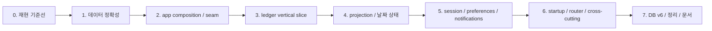

# 단계별 아키텍처 이행 계획

## 1. 이행 전략

이 리팩터링은 big-bang folder move가 아니라 **기존 동작을 먼저 관찰 가능하게 만든 뒤 vertical slice를 하나씩 교체하는 strangler 방식**으로 진행한다.



### 반드시 지킬 원칙

1. **파일 이동과 동작 변경을 가능한 한 같은 PR에 섞지 않는다.**
2. **DB schema migration은 UI/폴더 이동과 별도 PR로 둔다.**
3. 새 경로가 안정될 때까지 old provider를 얇은 compatibility facade로 유지한다.
4. facade에는 제거 milestone을 표시하고 새 코드가 facade를 참조하지 못하게 한다.
5. 각 PR은 이전과 이후의 사용자 관찰 동작을 테스트로 증명한다.
6. analytics/ads/notifications 장애는 핵심 command 성공을 뒤집지 않는다.
7. 한 단계 exit criteria를 만족하기 전 다음 대규모 단계를 시작하지 않는다.

아래 PR 번호는 의존성과 완료 조건을 분명히 하기 위한 **최대 36개의 독립 작업 패키지 후보**다. 실제 실행에서는 같은 위험 영역의 인접 패키지만 묶어 PR 수를 줄일 수 있지만, schema 변경·source of truth 변경·대규모 파일 이동은 서로 합치지 않는다. PR 개수 자체는 목표가 아니다.

## 2. 0단계 — 재현 가능한 기준선

목적: 리팩터링 전부터 존재한 결함과 새 회귀를 구분할 수 있게 한다.

### PR 0.1 — config·font·test bootstrap 복구

변경:

- .env를 runtime 필수 asset에서 분리한다.
- AppEnvironment가 누락/잘못된 config를 typed 상태로 보고한다. local 필수 값만 ConfigurationFailure이고 Supabase/Firebase 값은 remote capability unavailable로 분리한다.
- test에는 fake/placeholder environment를 provider override한다.
- 실제 Pretendard font binary와 license를 넣거나 system font로 제거한다.
- stale Counter widget test를 현재 app smoke test로 교체한다.
- 현재 UI와 어긋난 settings widget test를 수정한다.
- router analytics observer를 주입 가능하게 만들어 test에서는 SDK 없는 observer/Noop를 사용한다.

검증:

```text
flutter pub get
dart format --output=none --set-exit-if-changed .
flutter analyze
flutter test
```

Exit criteria:

- secret이 없는 clean checkout에서 test가 수집되고 실행된다.
- flutter analyze warning 0개.
- font file type 검사가 통과한다.
- 실제 Supabase/Firebase network 없이 app root widget test가 가능하다.

주의:

- 실제 key를 repository에 추가하지 않는다.
- Supabase anon key를 secret처럼 숨기는 것과 backend RLS를 혼동하지 않는다.

### PR 0.2 — 현재 동작 characterization

먼저 production behavior를 바꾸지 않는 최소 DB test seam을 만든다. 선택지는 sqflite_common_ffi 기반 host test 또는 device integration harness이며, repository가 test Database/DatabaseExecutor를 받을 수 있을 정도만 연다. AppDatabase의 최종 구조 분리는 PR 2.3에서 한다.

그 위에 다음 characterization test를 추가한다.

| 대상 | 최소 시나리오 |
| --- | --- |
| ExpenseRepository | empty month, query failure, malformed row, update 0행 |
| CoreExpensesNotifier | user/month별 load, empty month, create/update/delete, 다른 달 수정 |
| Expense form | create, edit, double submit, save failure |
| Home/Calendar | 현재 구현의 0원/누락일/streak/평균, KRW·IDR·USD decimal 결과 |
| Startup | existing/new user, Supabase·ad·notification 실패, initializer Remote Config 무시, update gate 정지 경로 |
| Reset | 현재 DB만 삭제하는 범위 |

Characterization test는 현재 잘못된 동작을 영구 규칙으로 승인하는 테스트가 아니다. 현재 동작을 명시적으로 assert해 **모두 통과시키고**, test 이름에 current_bug와 제거 milestone을 표시한다. 다음 hotfix PR에서 production 변경과 같은 commit으로 올바른 기대값으로 바꾼다. main에 의도적인 failing/skip test를 남기지 않는다.

Exit criteria:

- 이 PR 범위인 R-03~R-08, R-10~R-13에 명시적 passing current-behavior test 또는 재현 fixture가 있다. R-09 schema 제약은 DB migration fixture 단계에서 다룬다.
- 리팩터링 후 비교할 baseline output이 있다.

### PR 0.3 — ADR과 architecture guard 시작

먼저 확정:

- Local-first identity
- Money/currency
- 과거 월 budget 의미: current budget 기본, history 도입 여부
- category archive/kind
- 성공일/streak/평균
- 지원 플랫폼

architecture test를 추가하되 현재 위반은 allowlist로 등록한다.

```text
test/architecture/
  import_boundaries_test.dart
  allowed_legacy_imports.dart
```

새 위반은 즉시 실패하고 기존 위반은 이후 PR마다 줄인다. allowlist 항목은 file, reason, owner, removal phase를 가진다.

같은 PR에서 최소 CI를 켠다.

```text
format
analyze
unit/widget test
architecture boundary test
asset/config validation
```

후속 PR은 이 green baseline을 필수 check로 통과해야 한다. DB migration matrix와 platform build job은 7단계에서 확장한다.

### PR 0.4 — 최소 foundation과 관측 seam

ADR 결과를 코드로 표현하는 가장 작은 pure type/seam을 먼저 둔다.

- LocalDate, YearMonth, Money
- Clock / SystemClock / FakeClock
- IdGenerator / UuidGenerator / FakeIds
- AnalyticsTracker / Firebase adapter / Noop·throwing fake

아직 전체 호출부를 옮기지 않는다. 각 타입의 경계·rounding unit test와 provider override만 준비해 1단계 hotfix가 임시 문자열 key, DateTime.now, Firebase singleton에 다시 결합되지 않게 한다.

## 3. 1단계 — 데이터 정확성 hotfix

목적: 폴더 이동 전에 실제 사용자 데이터 손상·오인을 먼저 막는다.

### PR 1.1 — repository failure 계약

변경:

- getExpensesByMonth의 catch-to-empty 제거.
- update/delete affected row 검증.
- delete에 userId predicate 추가.
- StorageFailure/NotFoundFailure/CorruptDataFailure 최소 타입 도입.
- error와 stack trace 보존.
- UI에 empty와 error/retry를 구분.

테스트:

- 0행 update/delete는 NotFoundFailure.
- DB exception은 empty Map이 아님.
- 정상 0건은 data(empty).
- malformed type/date가 명시적 CorruptDataFailure.

Rollback:

- schema 변경이 없어 코드 rollback이 안전하다.

### PR 1.2 — form command 계약

변경:

- callback을 Future 기반으로 변경.
- submit 중 disable.
- 성공 후에만 pop/review.
- error면 form과 입력값 유지.
- edit 시 기존 date와 createdAt 보존, updatedAt만 변경.
- controller dispose.
- toggle index를 명시적으로 type에 매핑.
- analytics/ad/review는 저장 성공과 분리.
- Clock과 IdGenerator를 주입해 widget의 DateTime.now/Uuid 생성을 제거.

단기에는 현재 Expense entity를 써도 된다. Draft/Clock/IdGenerator 이전은 2~3단계에서 한다.

테스트:

- async command 완료 전 pop하지 않음.
- failure 후 retry 가능.
- edit 전후 id/date/createdAt 동일, updatedAt만 증가.
- submit 중 두 번째 command 0회.

### PR 1.3 — 월 identity와 invalidation

변경:

- cache key에 userId와 YearMonth 포함.
- empty month에서도 선택 월/state 변경.
- update 시 old/new date를 모두 전달하거나 기존 row를 조회해 두 월 invalidate.
- reset/session 변경 시 cache clear.
- Expense insert 후 analytics 실패가 state update를 막지 않음.

이 단계의 수동 cache 수정은 임시 안전장치다. 3단계에서 family query로 대체한다.

테스트:

- 동일 월, 다른 user는 다른 cache entry.
- 빈 월로 이동 가능.
- 1월 거래를 2월로 수정하면 두 월 모두 정확.
- analytics fake가 throw해도 repository commit과 query state는 성공.

### PR 1.4 — category와 reset 안전성

변경:

- 사용 중인 category 삭제를 막거나 임시 archive.
- built-in category 삭제 거부.
- reset UI 문구와 실제 scope 일치.
- analytics best-effort.
- DB reset 후 관련 Riverpod state invalidate.

DB FK는 아직 넣지 않는다. application guard로 먼저 보호하고 v6에서 schema가 강제한다.

### PR 1.5 — 통화별 예산 rounding hotfix

변경:

- calculateDailyBudget caller가 LocaleConfig.decimalDigits를 명시적으로 전달.
- KRW/IDR은 0자리, USD/EUR 등은 구성된 자릿수로 동일하게 계산.
- Home과 Calendar가 같은 입력에서 같은 threshold를 사용.
- Money 도입 전까지 rounding 함수는 pure helper 하나만 source로 사용.

테스트:

- 28/29/30/31일 월의 KRW·IDR·USD 월 예산 분배.
- floor/round 경계에서 Home·Calendar 성공 판정 일치.
- locale 표시 변경과 ledger currency 변경을 같은 동작으로 오인하지 않음.

### PR 1.6 — protected route guard hotfix

full router 전환을 기다리지 않고 최소 BootstrapGate 상태를 도입한다.

- checkingUpdate, initializing, needsSetup, ready, recoverableFailure, forceUpdate.
- /home, /calendar, /stats, /expense_list, /settings는 ready 전 직접 진입 금지.
- UpdateCheckScreen과 Splash의 결과를 widget-local bool/navigation이 아니라 gate state에 반영.
- GoRouter redirect가 initial location/deep link에도 동일 정책 적용.
- 기존 ShellRoute와 route path는 유지해 이 PR에서 탭 구조까지 바꾸지 않음.

테스트:

- 각 protected route direct initial location이 update/setup gate를 우회하지 않음.
- forceUpdate에서 protected route 접근 불가.
- needsSetup은 budget setup으로, ready는 원래 목적 route로 복귀.
- recoverableFailure는 무한 spinner가 아니라 retry 가능한 route.

## 4. 2단계 — app composition과 테스트 seam

목적: feature 이동 전에 concrete singleton과 SDK 직접 접근을 가장 바깥으로 밀어낸다.

### PR 2.1 — app 디렉터리와 composition root

이동:

```text
lib/main.dart                       → binding/config/runApp만 유지
lib/core/router/app_router.dart     → lib/app/router/app_router.dart
lib/widgets/bottom_nav_bar.dart     → lib/app/shell/app_shell.dart
MaterialApp 구성                   → lib/app/app.dart
repository concrete provider       → lib/app/composition/
```

이 PR에서는 route behavior를 바꾸지 않는다. import path와 composition 위치만 바꾸고 기존 ShellRoute를 유지한다.

Exit criteria:

- core/router가 사라짐.
- app만 모든 feature 화면과 concrete adapter를 조립.
- route smoke test가 이전 경로를 모두 연다.

### PR 2.2 — foundation seam 적용과 platform port 확대

PR 0.4에서 만든 Clock, IdGenerator, AnalyticsTracker를 composition provider로 승격하고 남은 static 호출부를 교체한다. 추가 port는 실제 호출이 있는 ExternalLinkLauncher만 먼저 둔다.

- ExternalLinkLauncher

교체 순서:

1. Expense command의 DateTime.now, Uuid
2. Spending/streak의 DateTime.now
3. data reset/review의 analytics
4. URL launch

규칙:

- provider override로 fake를 주입.
- feature 코드는 FirebaseAnalytics.instance, const Uuid(), DateTime.now에 직접 의존하지 않음.
- DateTime.now 전면 금지까지 할 필요는 없지만 business decision에서 금지.

### PR 2.3 — AppDatabase facade

현재 DatabaseHelper singleton 위에 injectable AppDatabase connection provider를 둔다. 이 단계에서는 schema v5를 유지한다.

분리:

```text
connection/open/reset        → AppDatabase
v5 cross-feature migration   → app/database/migrations
ledger/budget current schema → 각 feature/data/local
default category seed        → ledger data seed
dummy development seeder     → test/fixtures 또는 삭제
```

기존 repository가 AppDatabase를 생성자 주입받게 바꾼다. DatabaseHelper.instance 직접 사용은 composition/compatibility 외 0개가 목표다.

## 5. 3단계 — ledger vertical slice

목적: Expense·Category의 단일 owner를 만든다. 이 단계가 Feature-first 전환의 중심이다.

### PR 3.1 — pure domain과 data mapper

추가:

```text
features/ledger/domain/
  expense_entry.dart
  expense_draft.dart
  category.dart
  ledger_repository.dart

features/ledger/data/
  expense_row.dart
  category_row.dart
  ledger_mapper.dart
  sqlite_ledger_repository.dart
```

원칙:

- domain에 Flutter/sqflite import 없음.
- row DTO만 toMap/fromMap을 가짐.
- mapper가 legacy Expense/Category와 새 domain 사이 compatibility를 담당.
- schema v5를 그대로 읽고 쓰므로 이 PR에는 SQLite schema migration이 없음.

v5 Expense row에는 currency가 없으므로 현재 locale을 매 read마다 붙여 Money로 바꾸면 안 된다. ADR-002에 따라 다음 compatibility rule을 먼저 적용한다.

1. upgrade 시 사용자가 기존 장부의 통화를 확인하도록 하고 legacy_ledger_currency를 별도 metadata에 한 번 저장한다.
2. 이후 locale 또는 기존 UI의 currency selector가 바뀌어도 v5 row mapper는 이 snapshot만 사용한다. 최종 UI에서는 locale과 LedgerCurrency 설정을 분리한다.
3. 기존 통화를 신뢰성 있게 결정할 수 없다면 ExpenseEntry.amount를 Money로 가장하지 않고 LegacyAmount 상태로 유지해 v6 확인 migration까지 변경을 막는다.
4. v5의 owner_id가 null인 built-in category는 read context의 owner에 scope된 domain Category로 매핑하고, 실제 per-user row materialization은 v6 migration에서 수행한다.

테스트:

- row ↔ domain round trip.
- unknown enum이 silent fallback되지 않음.
- date-only/instant mapping.
- legacy currency snapshot이 locale 변경 뒤에도 유지됨.
- nullable built-in category row가 요청 owner의 domain Category로 안전하게 scope됨.

### PR 3.2 — query provider와 command

추가:

```text
features/ledger/application/
  ledger_queries.dart
  expense_commands.dart
  category_controller.dart
  ledger_providers.dart
```

구현:

- ExpenseMonthKey(ownerId, YearMonth)
- monthlyLedgerProvider.family
- ExpenseCommands create/update/delete
- old/new month invalidation
- category query/controller

기존 coreExpensesProvider는 새 query/command를 위임하는 compatibility facade가 된다. private cache는 제거한다.

Exit criteria:

- 월 data의 source of truth는 family provider 하나.
- user/month cache identity test 통과.
- empty/error 구분.
- 새 production 코드는 coreExpensesProvider를 참조하지 않음.

### PR 3.3 — editor/category presentation 이동

현재:

```text
core/widgets/expense_management/*
```

목표:

```text
features/ledger/presentation/editor/*
features/ledger/presentation/categories/*
```

View는 ExpenseDraft만 만들고 command intent를 호출한다. category dialog는 controller를 dispose하고 ViewModel state/effect를 사용한다.

광고와 review prompt는 editor 내부 command에서 제거한다. 성공 event를 monetization/review policy가 별도로 관찰한다.

### PR 3.4 — history/list 이동

features/expense의 list/filter UI를 ledger/presentation/history로 옮긴다. route path는 호환을 위해 /expense_list를 당분간 유지할 수 있다.

변경:

- initial copy state 제거.
- monthly/range query를 watch한 derived filter state.
- MonthYearPicker가 firstDate/lastDate를 실제 사용.
- sort 기준을 occurredOn + createdAt 등 명확한 field로 정의.
- statistics가 history presentation picker를 import하지 않도록 공통 MonthPicker를 design system 또는 각 feature의 작은 wrapper로 둔다.

### PR 3.5 — legacy core 제거

제거 후보:

- core/models/expense_model.dart
- core/models/category_model.dart
- core/repositories/expense_repository.dart
- core/repositories/category_repository.dart
- core/providers/expenses_provider.dart
- core/providers/category_providers.dart
- core/widgets/expense_management
- core/widgets/today_expense_list.dart의 feature 전용 부분

Exit criteria:

- Expense/Category production 코드의 owner가 features/ledger.
- core → settings ViewModel 관련 역참조 2개 제거.
- legacy facade/allowlist 제거.
- expense 관련 모든 test가 새 API 기준.

## 6. 4단계 — projection과 날짜 상태

### PR 4.1 — current budget feature와 v5 compatibility API

- User에서 budget/budgetType을 CurrentBudget domain으로 분리.
- currentBudgetProvider와 setup status contract 제공.
- 현재 schema v5 users table을 읽고 쓰는 compatibility repository 구현.
- budget setup 화면을 budget/presentation으로 이동.
- setup 여부를 dailyBudget == 0이 아니라 CurrentBudget 존재로 판단.

기본 정책은 과거 월도 현재 budget으로 계산한다는 현재 동작을 명시적으로 유지한다. 당시 예산 history가 제품 요구로 승인되기 전에는 BudgetPlan/effectiveFrom/migration을 만들지 않는다.

owner ID는 이 단계에서 기존 userSettings를 감싼 delegate-only CurrentOwner adapter로 받으며, budget이 settings ViewModel을 직접 import하지는 않는다. 이 임시 adapter는 PR 5.1 SessionContext로 교체한다.

### PR 4.2 — SpendingPolicy

ADR에서 확정한 규칙으로 pure Dart policy를 만든다.

table-driven test 축:

- daily/monthly budget
- 월 일수 28/29/30/31
- 0원 지출
- essential-only day
- record 없는 day
- budget 초과/경계값
- 과거/future day
- streak가 월 경계를 넘는지
- 현재 budget을 과거/현재 월에 적용하는 승인된 정책

Home과 Calendar의 기존 계산은 policy adapter로 교체한 뒤 삭제한다.

### PR 4.3 — Home projection

HomeViewModel:

- MonthlyLedger, CurrentBudget, homeDay를 watch.
- Color를 SpendingLevel로 교체.
- 완료되지 않는 Completer 제거.
- display mode를 별도 UI state로 보존.
- Expense command forwarding 제거; View가 ledger command를 사용.
- 평균과 streak는 SpendingPolicy 결과만 사용.

Exit criteria:

- HomeViewModel pure provider test가 Flutter context 없이 실행.
- build 재실행에도 선택 display mode 보존.
- Clock fake로 날짜 결과 고정.

### PR 4.4 — Calendar projection/state

분리:

- calendarVisibleMonth
- calendarSelectedDay
- CalendarUiState projection

CalendarHeader는 query fetch/광고/snackbar를 직접 실행하지 않는다. previous/next intent는 visible month를 바꾸고 provider가 자동 query한다. 빈 달도 정상 rendering한다.

### PR 4.5 — Statistics projection/state

- 435줄 screen의 provider 선언을 application으로 이동.
- mutable model을 immutable UiState로 변경.
- expense presentation import 제거.
- category color는 stable category ID 기반.
- rank color/text 하드코딩을 theme/l10n으로 이동.
- loading/empty/error/retry를 분리.

### PR 4.6 — global dateManager 제거

모든 consumer가 feature-specific state로 전환됐는지 rg로 확인한 뒤 삭제한다. 하단 탭 전환의 DateTime.now reset도 제거한다.

Exit criteria:

- calendar month 변경이 stats/home/history state를 바꾸지 않음.
- 탭 왕복 후 각 선택 상태 유지.
- dateManager 참조 0개.

## 7. 5단계 — session, preferences, notifications

### PR 5.1 — session context 분리

SessionContext를 도입해 settings dependency를 제거하고, 같은 단계에서 owner identity를 remote session보다 먼저 결정한다.

```text
SessionState
  loading
  ready(ownerId, remoteSession?)
  recoverableFailure
```

Home/Calendar/Ledger/Onboarding은 userSettingsProvider 대신 session/budget API를 사용한다.

v5 compatibility 전략:

1. 신규 설치는 network 호출 전에 UUID LocalUserId를 생성·영속화하고 v5 users row의 id로 사용한다.
2. 기존 설치는 영속화된 local ID가 없으면 v5 users의 단일 row ID를 그대로 LocalUserId로 채택한다. 값의 모양이 과거 Supabase ID여도 row key를 다시 쓰지 않는다.
3. local user가 여러 개라면 조용히 첫 row를 선택하지 않고 cached remote mapping 또는 recovery 선택이 필요하다.
4. Supabase user ID는 별도 remote mapping metadata로 저장하고 ledger owner key로 사용하지 않는다.
5. 이 mapping을 원자적으로 저장한 뒤에만 migration-complete marker를 기록한다.

따라서 PR 5.1 완료 시점에 기존/신규 사용자 모두 offline에서 LocalUserId와 local ledger를 열 수 있어야 한다. v6는 remote_user_id column과 정식 relation을 materialize할 뿐, offline-ready 의미를 7단계까지 미루지 않는다.

Exit criteria:

- 신규 offline first launch가 local user와 budget setup을 연다.
- 기존 단일-user v5 DB가 Supabase 없이 같은 Expense owner rows를 읽는다.
- remote session 변경이 LocalUserId를 바꾸거나 ledger cache를 오염시키지 않는다.

### PR 5.2 — preferences 단일 state

ThemeSettings와 LocaleConfig의 저장을 AppPreferences 하나로 통합한다.

순서:

1. legacy SharedPreferences keys를 읽는 idempotent migration.
2. PreferencesRepository 한 번의 write로 전체 state 저장.
3. seed/mode/font/locale derived provider 제공.
4. MyApp build 안의 dark-mode migration 제거.
5. User SQLite의 deprecated preference read/write 중단.

현재 LocaleConfig에 묶인 currency 선택은 preferences에서 제거하고 ledger의 LedgerCurrency command로 이동한다. ledger에 금액이 있으면 일반 toggle처럼 바꾸지 않는다.

주의:

- migration 완료 marker는 저장 성공 후에만 기록.
- 여러 앱 버전이 동일 DB/prefs를 열 수 있는 downgrade 시나리오를 고려.

### PR 5.3 — notifications

분리:

```text
NotificationGateway   plugin init/schedule/cancel
PermissionGateway     OS permission/open settings
NotificationController preference + permission + schedule orchestration
Notification UI       dialog/snackbar/l10n
```

NotificationService에서 BuildContext, WidgetRef, UserSettings import를 제거한다. schedule은 한 command에서 한 번만 일어난다.

### PR 5.4 — reset coordinator

명시적 scope:

- ledger/budget local data
- preferences
- session
- scheduled notifications
- review/monetization counters
- all

각 scope를 test하고 완료 후 관련 provider를 invalidate한다. Phoenix 전체 restart가 반드시 필요한지 재평가한다. ProviderContainer invalidation으로 충분하면 flutter_phoenix dependency를 제거한다.

## 8. 6단계 — startup, router, cross-cutting feature

### PR 6.1 — BootstrapController

PR 1.6의 최소 BootstrapGate를 정식 BootstrapController로 확장하고, 현재 appInitializer와 Splash의 manual navigation을 제거한다.

Critical:

- environment validation
- AppDatabase open/migration
- preferences
- local session/profile
- setup status

Best-effort:

- Firebase core init + analytics Noop fallback
- ads
- notifications
- Remote Config refresh
- Supabase lazy init + remote refresh

best-effort 작업은 ready 후 병렬 실행하며 timeout/failure를 기록하되 home 진입을 막지 않는다.

main은 Firebase.initializeApp과 Supabase.initialize를 무조건 await하지 않는다. Firebase가 unavailable이면 route analytics observer도 AnalyticsTracker Noop를 사용하고, Supabase가 unavailable이면 feedback/remote session capability만 unavailable이 된다.

테스트 matrix:

| DB | Session | Budget | Optional SDK | 결과 |
| --- | --- | --- | --- | --- |
| 성공 | 기존 local | 있음 | 성공/실패 | ready |
| 성공 | 신규 local | 없음 | 성공/실패 | needsSetup |
| 실패 | 무관 | 무관 | 무관 | recoverableFailure |
| 성공 | local 있음 | 있음 | network offline | ready |
| 성공 | local 있음 | 있음 | Firebase/Supabase init 실패 | ready + remote capability unavailable |
| 성공 | local 있음 | 있음 | cached force update | forceUpdate |

### PR 6.2 — router state와 indexed shell

- StatefulShellRoute.indexedStack 적용.
- navigationIndexProvider 제거.
- typed route/arguments.
- router redirect가 BootstrapState/SetupStatus를 구독.
- bottom nav는 goBranch만 호출.
- global SafeArea 제거.

검증:

- deep link 경로와 선택 탭 일치.
- Android back/iOS swipe/back stack.
- 탭별 nested route와 scroll state 보존.
- setup 완료 직후 home redirect.
- force update/recoverable failure route.

### PR 6.3 — update/monetization/feedback

현재 core/services와 core/widgets의 업무 기능을 각각 owner로 옮긴다.

| 현재 | 목표 |
| --- | --- |
| update_service + update_check_screen | features/app_update |
| ad_service + ad_banner_widget | features/monetization |
| review_prompt_service + review_system | feedback 또는 engagement 정책 |
| contact_us_dialog의 Supabase insert | features/feedback data/application |

규칙:

- service가 widget enum/type을 import하지 않음.
- ScreenType 같은 UI sizing은 presentation 값.
- backend inquiry type은 localized label이 아닌 stable code.
- analytics/ads/review 실패는 ledger command 결과와 독립.

### PR 6.4 — theme/UI 단순화

- theme notifier 3개를 PreferencesController 기반 derived state로 전환.
- light/dark ThemeData 공통 factory.
- deprecated app_theme/design_palette 제거.
- responsive text wrapper 통합.
- review dialog branch 축소.
- statistics/settings superfile을 변경 이유 기준으로 분리.

접근성 font scale과 다국어 overflow를 실제 device/widget test로 검증한 뒤 wrapper를 제거한다.

## 9. 7단계 — SQLite v6와 최종 정리

### PR 7.1 — migration audit와 fixture

코드 변경 전 현재 사용자 DB에서 발생 가능한 data shape를 조사한다.

- orphan user/category reference
- ExpenseType.n 또는 알 수 없는 string
- amount <= 0, NaN/Infinity 가능성
- 잘못된 date/timestamp
- 중복 category stable ID
- users row 수와 anonymous ID 형태
- currency별 REAL amount

실제 사용자 값을 log하거나 analytics로 보내지 않는다. local migration dry-run/debug report는 count와 category만 사용한다.

fixture:

```text
test/fixtures/database/
  v1.db
  v2.db
  v3.db
  v4.db
  v5_empty.db
  v5_typical.db
  v5_orphaned.db
  v5_edge_amounts.db
```

구현에서는 binary DB snapshot 대신 같은 이름의 review 가능한 synthetic JSON
recipe를 `test/fixtures/database/`에 추적하고, 테스트가 이를 실제 in-memory
SQLite v5 DB로 materialize한다. 따라서 fixture는 portable하고 customer data를
포함하지 않으면서도 audit와 실제 migration transaction을 모두 검증한다.

### PR 7.2 — v6 schema migration

[목표 schema](./03-target-architecture.md#9-sqlite-v6-후보)를 ADR 결과에 맞춰 확정한다.

필수 검증:

- migration transaction.
- backup 또는 원본 보존 전략.
- legacy LedgerCurrency snapshot과 그 단위의 REAL → minor unit rounding.
- owner ID mapping.
- category orphan 처리와 global built-in category의 user별 materialization/Expense remap.
- row count와 aggregate amount 보존.
- FK/check/index 활성과 cross-owner category 참조 거부.
- fractional amount_minor, mixed ledger currency, 잘못된 date/timestamp shape 거부.
- 앱 강제 종료 후 재실행 idempotency.

Rollback:

DB version은 내려갈 수 없으므로 단순 코드 rollback을 배포 전략으로 삼으면 안 된다. 구버전 앱이 v6 DB를 열 수 없음을 전제로 staged rollout과 forward-fix build를 준비한다.

### PR 7.3 — dead code/dependency/assets/repo hygiene

서로 독립적인 작은 commit으로:

- 미도달·전부 주석 파일 제거.
- dummy seeder를 test fixture로 이동.
- unused repository method/interface 정리.
- cupertino_icons, auto_size_text 등 확인된 미사용 dependency 제거.
- 미참조 runtime assets 제거 또는 pubspec에서 명시 목록 사용.
- package-lock.json 처리.
- Android/iOS만 지원한다면 Windows scaffold/문서 정리.
- .gitignore inline comment 수정과 git check-ignore test.
- tracked IPA/dSYM/report 제거.
- Fastlane absolute/personal config를 env로 이동.

Git history에서 75MB artifact를 완전히 제거하는 작업은 remote force-push와 팀 clone 영향이 있으므로 별도 승인된 maintenance window에서만 한다.

### PR 7.4 — CI 확대와 문서 승격

PR 0.3의 필수 format/analyze/test/boundary/config job을 유지하고 다음 job을 확대한다.

```text
format
analyze
unit/widget test
database migration test
architecture boundary test
asset/config validation
Android debug build
iOS build는 runner/CI 환경이 있을 때
```

문서:

- root README architecture section을 목표 구조에 맞게 갱신.
- docs/learn은 Historical/Intent 상태 표시.
- ADR index 추가.
- feature별 public API와 owner 기록.
- 이번 분석의 “현재 구조”는 migration 완료 후 historical baseline으로 표시.

## 10. 현재 → 목표 파일 매핑

| 현재 경로 | 목표 경로/조치 | 유형 | 단계 |
| --- | --- | --- | ---: |
| lib/main.dart | binding/config/runApp만 남김 | 축소 | 2, 6 |
| core/router/app_router.dart | app/router/app_router.dart | 이동 | 2 |
| widgets/bottom_nav_bar.dart | app/shell/app_shell.dart | 재작성 | 2, 6 |
| core/services/app_initializer.dart | app/bootstrap/bootstrap_controller.dart | 재작성 | 6 |
| auth/view/splash_screen.dart | app/bootstrap presentation 또는 router state | 축소/제거 | 6 |
| core/widgets/update_check_screen.dart | features/app_update/presentation | 이동 | 6 |
| core/services/update_service.dart | features/app_update/data/application | 분리 | 6 |
| core/database/database_helper.dart | core/database/app_database + app/database/migrations | 분리 | 2, 7 |
| core/database/database_seeder.dart | test fixture 또는 삭제 | 제거 | 7 |
| core/models/expense_model.dart | ledger/domain + ledger/data row | 분리 | 3 |
| core/models/category_model.dart | ledger/domain + ledger/data row | 분리 | 3 |
| core/repositories/expense_repository.dart | ledger/data/sqlite_ledger_repository.dart | 이동/재작성 | 3 |
| core/repositories/category_repository.dart | ledger/data/sqlite_ledger_repository.dart | 통합 | 3 |
| core/providers/expenses_provider.dart | ledger/application query + commands | 분리 | 3 |
| core/providers/category_providers.dart | ledger/application/category_controller.dart | 이동 | 3 |
| core/widgets/expense_management | ledger/presentation/editor + categories | 이동/단순화 | 3 |
| features/expense | ledger/presentation/history | rename/이동 | 3 |
| home/viewmodel/home_data_provider.dart | home/application + ledger SpendingPolicy | 분리 | 4 |
| calendar/model + viewmodel | calendar/application UiState/ViewModel | 재구성 | 4 |
| statistics/model + viewmodel | statistics/application UiState/ViewModel | 재구성 | 4 |
| statistics/view/statistics.dart | statistics/presentation 섹션 | 분리 | 4 |
| core/providers/select_date_provider.dart | feature별 date state | 제거 | 4 |
| core/models/user_model.dart | budget + session + preferences 모델 | 분해 | 4, 5 |
| onboarding/budget_setup_* | budget/presentation | 이동 | 4 |
| settings/viewmodel/user_settings_provider.dart | budget/session/notification controllers | 분해/제거 | 4, 5 |
| core/providers/locale_provider.dart | preferences derived provider | 통합 | 5 |
| core/providers/theme_provider.dart | preferences + design ThemeFactory | 분리/축소 | 5, 6 |
| core/services/notification_service.dart | notifications data/application | 분리 | 5 |
| core/services/data_reset_service.dart | app reset coordinator | 재작성 | 5 |
| core/services/ad_service.dart | monetization data/application | 분리 | 6 |
| core/widgets/ads | monetization presentation | 이동 | 6 |
| core/services/review_prompt_service.dart | feedback/engagement application | 이동/축소 | 6 |
| core/widgets/review_system | feedback presentation | 이동/축소 | 6 |
| settings/widgets/contact_us_dialog.dart | feedback presentation/application/data | 분리 | 6 |
| core/functions/functions.dart | domain/format/platform owner로 이동 | 해체 | 3~6 |
| core/theme/app_theme.dart + design_palette.dart | 삭제 | 제거 | 6/7 |
| core/widgets/update_gate.dart | 삭제 | 제거 | 7 |
| core/repositories/category.dart | 삭제 | 제거 | 7 |
| core/repositories/theme_repository_provider.dart | 삭제 | 제거 | 5/7 |

## 11. PR별 review checklist

모든 PR:

- 어떤 source of truth가 바뀌었는가?
- 실패와 empty를 구분하는가?
- userId/month/date identity가 완전한가?
- old/new state invalidation이 명시적인가?
- View 또는 ViewModel에 SDK singleton이 새로 들어오지 않았는가?
- core → feature 또는 presentation → 다른 presentation import가 늘지 않았는가?
- migration/compatibility code의 제거 시점이 있는가?
- 새 상태에 unit/provider test가 있는가?
- analytics에 개인정보/금액이 들어가지 않는가?
- 접근성·locale·offline 동작을 악화시키지 않는가?

DB PR 추가:

- 모든 이전 version fixture를 upgrade했는가?
- row count/aggregate/ID/date relation을 비교했는가?
- 중간 실패 시 원본이 유지되는가?
- downgrade/forward-fix 배포 전략이 있는가?

## 12. 단계별 정량 목표

| 지표 | 현재 | 중간 목표 | 최종 |
| --- | ---: | ---: | ---: |
| core → feature direct import | 12 | 2단계 5 → 3단계 2 → 5단계 1 | 6단계 0 |
| file-level cycle | 2 | 5단계 notification cycle 제거 후 1 | 6단계 0 |
| global date state | 1개가 5의미 | projection 단계에서 제거 | 0 |
| Expense source of truth | public 월 state + private 수동 cache | family query | family query 1 |
| preference source | User DB + locale prefs + theme prefs + OS | controller별 이전 | AppPreferences 1 + OS state |
| startup optional blocking | ads/notification/remote/auth 포함 | 병렬/fail-open | critical 0개 외부 optional |
| DB migration tests | 0 | 0단계 v5 repository harness | 7단계 모든 지원 version fixture |
| ledger/provider 핵심 테스트 | 0 | hotfix마다 추가 | CRUD/query/invalidation 전체 |
| 미도달 후보 | 1,151 LOC | 제품 결정 | 0 또는 명시 보존 |
| analyze/test | warning/asset 중단 | 0단계 0 warning/all run + 최소 CI | 최종 CI 확장 required |

core → feature 12개 중 router 조립 7개는 2단계 app 이동으로 사라진다. ledger 이동 후 app initializer → home과 notification → settings 두 개가 남고, 5단계 notification 분리 후 app initializer 한 개, 6단계 Bootstrap 전환 후 0개가 된다. cycle도 같은 실제 제거 단계에 맞춰 2 → 1 → 0으로 줄인다.

## 13. 위험과 완화

| 위험 | 발생 단계 | 완화 |
| --- | --- | --- |
| 파일 이동 중 기능 누락 | 2~4 | route smoke + compatibility facade + 작은 PR |
| 두 provider가 동시에 source가 됨 | 3~5 | write는 한 경로만 허용, facade는 delegate-only |
| stale cache/중복 query | 1~4 | family key test, old/new invalidation test |
| async UX regression | 1~3 | form widget test, saving/effect 명시 |
| local-first ID 전환 시 row ownership 손실 | 5/7 | mapping table, fixture, aggregate 비교 |
| REAL → integer rounding | 7 | currency ADR, representative/edge fixture |
| category FK 적용 시 orphan migration 실패 | 7 | 사전 audit, archive/placeholder 정책 |
| old app이 v6 DB를 못 엶 | 7 | staged rollout, forward-fix 준비, backup |
| optional SDK adapter가 무한 확장 | 2/6 | 실제 호출에 필요한 작은 port만 |
| Clean Architecture 파일 폭증 | 전 단계 | CRUD별 class 금지, 빈 layer 금지 |
| UI 분리 후 접근성 저하 | 6 | font scale/locale widget test |

## 14. 릴리스 전략

### schema 변경 전

대부분 code-only이므로 문제가 생기면 해당 release를 rollback할 수 있다. 다만 같은 앱 버전에서 두 source of truth가 write하지 않도록 compatibility facade를 delegate-only로 유지한다.

### schema v6

1. migration telemetry는 개인 데이터 없이 success/failure/version/count만 기록한다.
2. internal/TestFlight/closed track에서 v1~v5 fixture와 실제 upgrade를 검증한다.
3. staged rollout을 사용한다.
4. migration 실패 시 원본 DB를 보존하고 recoverable UI와 support/export 경로를 제공한다.
5. v6 배포 후에는 구버전 binary rollback 대신 forward-fix를 기본으로 한다.

### feature flag

같은 local DB에 old/new writer를 동시에 두는 flag는 피한다. read-only projection 전환에는 flag를 쓸 수 있지만 ledger write path는 release 단위로 하나만 활성화한다.

## 15. 가장 먼저 만들 작업 목록

실행을 시작한다면 다음 10개 이슈가 선행 backlog다.

1. build: .env 없는 clean test 환경과 AppEnvironment 도입
2. asset: 실제 Pretendard font 또는 system font 결정
3. test/CI: SQLite v5 characterization harness, green baseline, import allowlist
4. fix: repository catch-to-empty/update swallow 제거
5. fix: async Expense form과 edit timestamp 보존
6. fix: ExpenseMonthKey 및 empty month/invalidation
7. fix: category delete와 reset scope 안전성
8. fix: KRW/IDR/USD budget rounding 일치
9. fix: protected deep link의 update/setup/startup gate 우회 차단
10. ADR/foundation: spending policy, 단일 LedgerCurrency, 과거 월 budget 의미, LocalDate/YearMonth/Clock/ID/Analytics seam

이 10개가 끝난 뒤 2단계 app composition과 3단계 ledger vertical slice를 시작한다. 그 전에는 대규모 폴더 rename이나 DB v6를 시작하지 않는다.

## 16. 최종 인수 기준

[목표 아키텍처의 완료 정의](./03-target-architecture.md#17-완료-상태의-정의)에 더해 release 관점에서 다음을 확인한다.

- 기존 v5 사용자 지출 총액·개수·날짜·category relation이 migration 후 보존된다.
- offline 첫 실행과 기존 사용자 재실행이 정의된 결과를 낸다.
- 빈 달, DB 오류, network 오류가 서로 다른 UI state다.
- 과거 거래 수정이 createdAt과 원래 날짜를 보존한다.
- 통화 변경이 과거 금액을 조용히 relabel하지 않는다.
- Home·Calendar·Statistics가 같은 SpendingPolicy fixture 결과를 보인다.
- 탭 전환이 다른 기능의 날짜를 초기화하지 않는다.
- reset 문구와 실제 삭제 scope가 일치한다.
- optional SDK 실패가 local ledger 사용을 막지 않는다.
- clean checkout CI가 format/analyze/test/migration/boundary 검사를 모두 통과한다.

요약으로 돌아가기: [README.md](./README.md)
